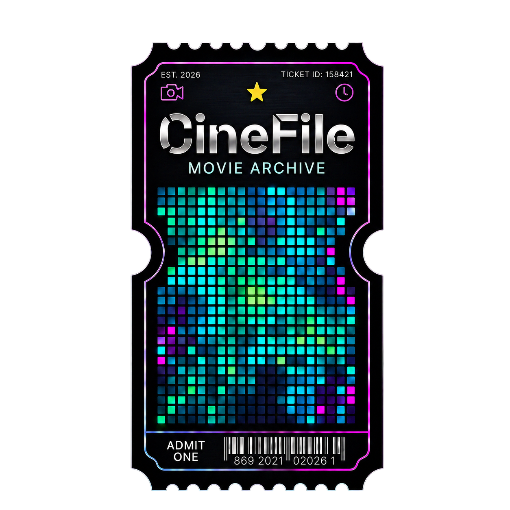

<div align="center">



# 🎬 CineFile

**Film & Dizi İzleme Günlüğü**

Sinema ve dizi tutkunları için tasarlanmış, koyu tema ve cam efekti (glassmorphism) detaylarına sahip **premium bir kişisel izleme günlüğü, analiz ve topluluk uygulaması.**

[](https://flutter.dev)
[](#-teknolojik-altyapı)
[](https://firebase.google.com)
[](https://www.themoviedb.org)

### 👉 [Canlı Web Demosunu Dene](https://Alp3rol.github.io/CineFile/)

</div>

---

## 📖 Nedir?

CineFile, izlediğiniz her film ve diziyi — hatta aynı yapımı birden fazla izleyişinizi bile — tarih, mekan, ruh hali, puan ve kişisel notlarla kayıt altına almanızı sağlayan bir günlük uygulamasıdır. İzleme verileriniz üzerinden zengin istatistikler çıkarır, dizilerinizi bölüm bölüm takip eder ve isterseniz izleme günlüğünüzü bir topluluk akışında arkadaşlarınızla paylaşmanıza olanak tanır.

## ✨ Özellikler

### 📖 İzleme Günlüğü & Takip
- **Çoklu İzleme Kaydı:** Bir yapımı kaç kez, ne zaman, nerede (Sinema, Ev, Yolculukta...) ve kiminle izlediğinizi ayrı ayrı kaydedin. 1-10 puan, ruh hali emojisi, kişisel not ve özel etiketler (#tag) ekleyin.
- **Dizi Bölüm Takibi ("Aktif İzliyorum"):** Dizileri bölüm bölüm takip edin — sistem nerede kaldığınızı hatırlar, sıradaki bölümü otomatik önerir, seri bitince durumu otomatik günceller.
- **Hızlı Ekleme:** Ana Sayfa ve Günlük'teki tek dokunuşluk "+" rozetiyle, detay sayfasına hiç girmeden sıradaki bölümü ilerletin.
- **Akıllı Tarih Seçici & Platform Simgeleri:** Bir yapımı vizyon tarihinden önce "izledim" diyemezsiniz; girdiğiniz mekandan (Netflix, Prime, Sinema...) platform otomatik tanınıp ikonlanır.

### 📊 Analizler & İçgörüler
- **İzleme Yoğunluğu Haritası:** Yıllık izleme sıklığını gün gün gösteren GitHub tarzı, yıl gezinmeli bir ısı haritası.
- **Puan Dağılımı & Eleştirmen Profili:** Verdiğiniz puanların dağılım grafiği ve ortalamanıza göre esprili bir yorum.
- **İzleme Serileri (Streak):** Güncel ve en uzun izleme serileriniz, haftalık hedef ilerlemesi.
- **Alışkanlık Analizi:** En çok izlenen yönetmenler/oyuncular/türler, mevsimsel dağılım, en aktif gün ve saatler, eğlenceli zaman kıyaslamaları.

### 👥 Topluluk & Sosyal
- **Topluluk Akışı:** İzleme kayıtlarınızı, günlüğünüzün bir kesitini veya paylaşıma açtığınız bir koleksiyonu yapılandırılmış gönderiler olarak paylaşın.
- **Takip Sistemi & Kullanıcı Arama:** Diğer kullanıcıları kullanıcı adına göre bulun, takip edin; akışı "Tümü" / "Takip Ettiklerim" olarak filtreleyin.
- **Beğeni & Yorum:** Gönderilere yıldızla beğeni bırakın, gerçek zamanlı yorum yapın.
- **Opt-in Gizlilik:** Paylaşım tamamen isteğe bağlıdır — her kayıt varsayılan olarak **gizlidir**, yalnızca açıkça paylaştığınız içerik herkese görünür (bkz. [Gizlilik](#-gizlilik--veri) bölümü).

### 📁 Koleksiyonlar & Keşif
- **Özel Listeler & Maratonlar:** Kendi koleksiyonlarınızı oluşturun, sürükle-bırak ile sıralayın, neon ilerleme çubuklarıyla tamamlanma oranını takip edin; isterseniz canlı senkronize şekilde toplulukla paylaşın.
- **Engelsiz Arama ve Keşif:** Türkiye'deki TMDb erişim engellerini DNS-over-HTTPS (DoH) ve resmi domain fallback katmanıyla otomatik aşarak film/dizi arar, tür filtreleriyle keşif sunar.

## 🔒 Gizlilik & Veri

CineFile **yerel öncelikli** bir mimariyle çalışır: tüm izleme kayıtlarınız, notlarınız ve ayarlarınız varsayılan olarak **gizlidir** ve yalnızca siz görürsünüz. Topluluk özellikleri tamamen **opt-in**'dir — bir kaydı ya da koleksiyonu açıkça paylaşmadığınız sürece kimse göremez; sunucu tarafında da bu kurallar [`firestore.rules`](firestore.rules) ile zorunlu kılınır. Verilerinizi istediğiniz zaman JSON formatında dışa aktarabilir veya bir yedekten geri yükleyebilirsiniz.

## 🛠️ Teknolojik Altyapı

| Katman | Teknoloji |
|---|---|
| Arayüz & Framework | Flutter (Android, iOS, Web, Windows) |
| Durum Yönetimi | Riverpod |
| Yerel Veritabanı | Drift (SQLite) — Web'de bellek içi (in-memory) simülasyon |
| Bulut & Kimlik Doğrulama | Firebase Auth + Cloud Firestore |
| Ağ İstemcisi | Dio — özel proxy yönlendirme ve DoH entegrasyonu ile |
| Grafikler | `fl_chart` |
| Veri Kaynağı | [The Movie Database (TMDb)](https://www.themoviedb.org) API |

## 🚀 Yerelde Çalıştırma

```bash
git clone https://github.com/Alp3rol/CineFile.git
cd CineFile
flutter pub get
flutter run
```

> Uygulamayı çalıştırmak için `lib/core/constants/api_key.dart` içinde bir TMDb API anahtarı ve Firebase projeniz için oluşturulmuş `lib/firebase_options.dart` dosyası gerekir (ikisi de gizlilik nedeniyle `.gitignore`'dadır).

## 🗺️ Yol Haritası

Sürüm bazlı geliştirme geçmişi ve gelecek planları için [`roadmap.md`](roadmap.md) dosyasına bakabilirsiniz.

---

## 📝 TMDb Atfı

Bu uygulama TMDB API'sini kullanır ancak TMDB tarafından desteklenmez veya onaylanmaz.
*(This product uses the TMDB API but is not endorsed or certified by TMDB.)*

<p align="center">
  <a href="https://www.themoviedb.org/">
    
  </a>
</p>
