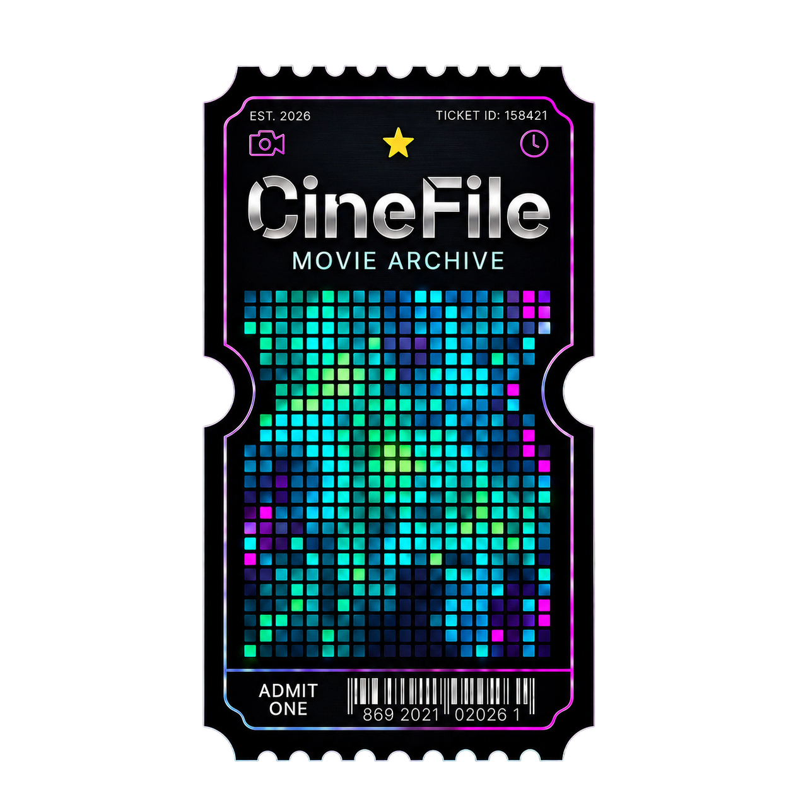
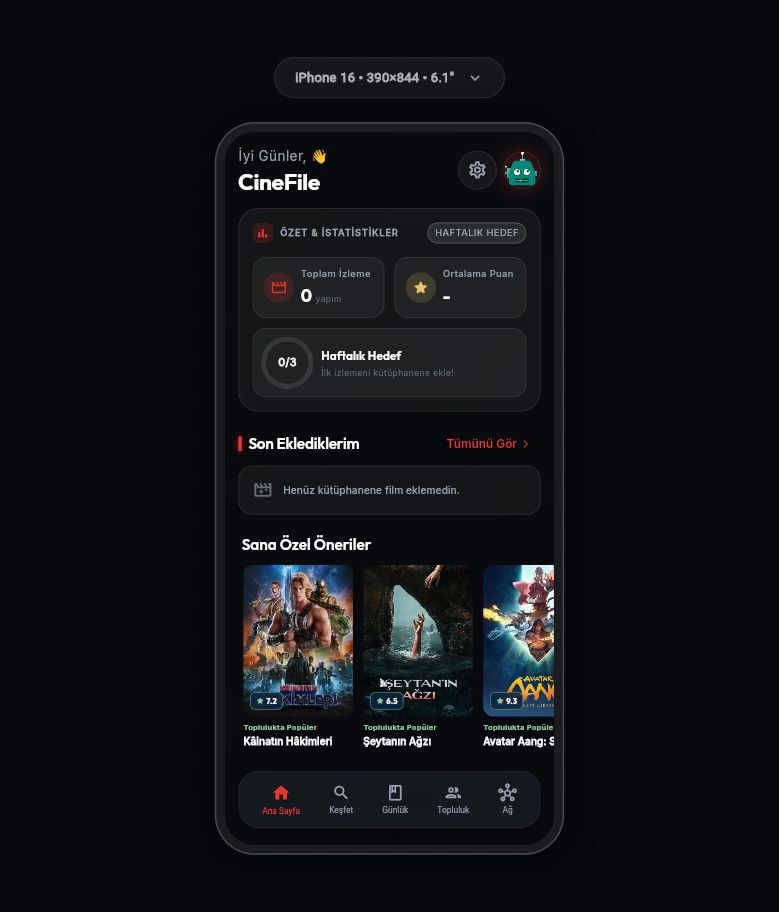
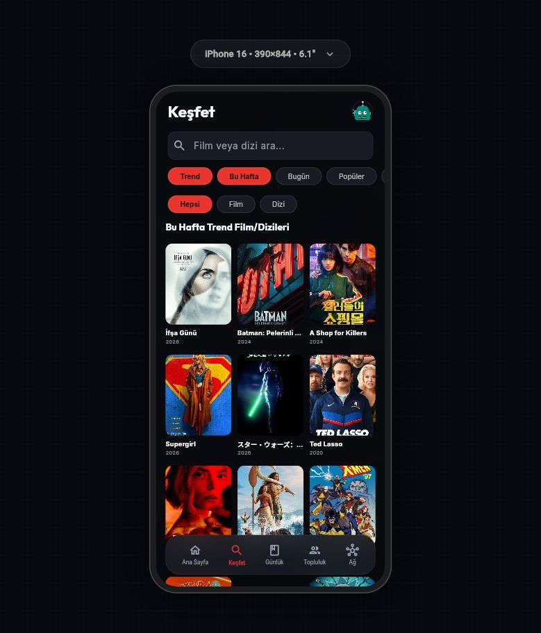
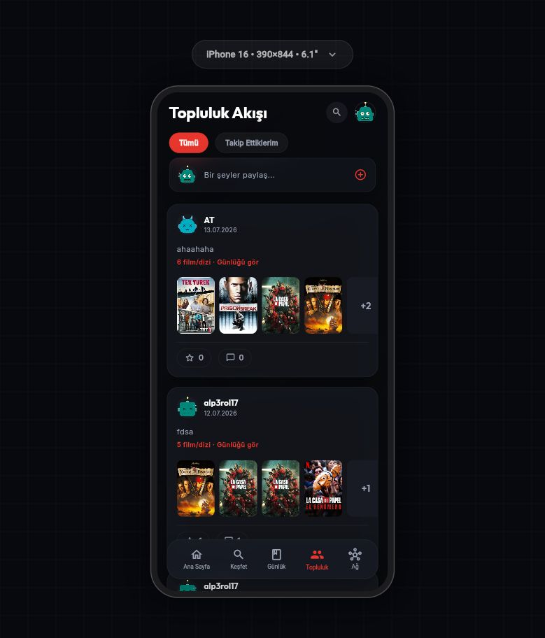

<div align="center">



# CineFile

### İzlediklerini kaydet. Alışkanlıklarını keşfet. Sinema zevkini paylaş.

CineFile; filmlerini ve dizilerini kaydedebileceğin, bölüm ilerlemeni takip edebileceğin, izleme alışkanlıklarını inceleyebileceğin ve seçtiğin anları toplulukla paylaşabileceğin kişisel bir izleme günlüğüdür.

*A personal movie and TV diary for tracking, discovering and sharing what you watch.*

[](https://Alp3rol.github.io/CineFile/)

[](https://flutter.dev)
[](https://firebase.google.com)
[](https://www.themoviedb.org)
[](https://github.com/Alp3rol/CineFile/actions/workflows/ci.yml)

<br>



</div>

---

## Uygulamadan görüntüler

<div align="center">

<table>
  <tr>
    <td align="center"><strong>Keşfet</strong></td>
    <td align="center"><strong>Topluluk</strong></td>
  </tr>
  <tr>
    <td></td>
    <td></td>
  </tr>
</table>

</div>

## Neden CineFile?

### Her izleyişini hatırla

Aynı yapımı birden fazla kez izlesen bile her kaydı ayrı tut. Tarih, puan, ruh hâli, mekân, izleme arkadaşı, kişisel not ve etiketlerini ekle.

### Dizilerde kaldığın yeri kaybetme

Sezon ve bölüm ilerlemeni takip et. CineFile sıradaki bölümü hatırlar; hızlı ekleme ile tek dokunuşta ilerleyebilirsin.

### Kendi izleme hikâyeni keşfet

Yıllık izleme haritanı, puan dağılımını, izleme serilerini ve en çok tercih ettiğin tür, oyuncu ve yönetmenleri gör.

## Öne çıkan özellikler

| | |
|---|---|
| **Günlük ve takip** | Film ve dizi kayıtları, tekrar izlemeler, sezon/bölüm ilerlemesi ve tek dokunuşla hızlı kayıt |
| **İçgörüler** | GitHub tarzı izleme yoğunluğu haritası, puan analizi, izleme serileri ve alışkanlık istatistikleri |
| **Koleksiyonlar** | Kişisel listeler, sürükle-bırak sıralama, maratonlar ve tamamlanma ilerlemesi |
| **Keşif** | Gündemdeki yapımlar, türe ve yayın platformuna göre filtreleme, oyuncu profilleri ve kişisel öneriler |
| **Topluluk** | Kullanıcı profilleri, takip sistemi, gönderiler, yorumlar, beğeniler ve paylaşılan koleksiyonlar |
| **Cine Twin** | Benzer sinema zevklerine sahip kullanıcıları ve onların beğenilerinden doğan önerileri keşfetme |
| **İlişki grafiği** | İzlediğin yapımlar arasındaki ortak oyuncu bağlantılarını etkileşimli bir ağ üzerinde inceleme |
| **Kişiselleştirme** | Türkçe ve İngilizce arayüz, dinamik arka planlar, ülkeye göre yayın seçenekleri ve bildirim tercihleri |

## Gizlilik önce gelir

CineFile'da izleme kayıtları **varsayılan olarak gizlidir**. Bir kaydı veya koleksiyonu açıkça paylaşmadığın sürece diğer kullanıcılar göremez.

- İzleme kayıtlarına yalnızca hesap sahibi erişebilir.
- Topluluk paylaşımları tamamen isteğe bağlıdır.
- E-posta adresi herkese açık profil belgesinde saklanmaz.
- İzleme geçmişi ve koleksiyonlar JSON olarak dışa aktarılıp geri yüklenebilir.
- Sunucu tarafındaki erişim sınırları [`firestore.rules`](firestore.rules) ile uygulanır.
- İsteğe bağlı hata raporlama, kişisel veri ve ekran görüntüsü göndermez.

## Platformlar

| Platform | Durum |
|---|---|
| Web | [Canlı sürüm](https://Alp3rol.github.io/CineFile/) |
| Android | Kaynak koddan çalıştırılabilir |
| iOS | Kaynak koddan çalıştırılabilir |
| Windows | Kaynak koddan çalıştırılabilir |

> Şu anda herkese açık olarak yayımlanan sürüm web uygulamasıdır. Mobil ve Windows mağaza paketleri henüz sunulmamaktadır.

## Yerelde çalıştırma

### Gereksinimler

- Flutter SDK
- Bir [TMDb API anahtarı](https://developer.themoviedb.org/docs/getting-started)
- Bulut ve topluluk özellikleri için bir Firebase projesi

### Hızlı başlangıç

```bash
git clone https://github.com/Alp3rol/CineFile.git
cd CineFile
flutter pub get
flutter run --dart-define=TMDB_API_KEY=TMDB_ANAHTARINIZ
```

TMDb anahtarını komuta eklemek yerine git tarafından izlenmeyen `lib/core/constants/api_key.dart` dosyasında da tanımlayabilirsin:

```dart
const String defaultTmdbApiKey = 'TMDB_ANAHTARINIZ';
```

Web derlemesinde anahtarı istemci paketine yerleştirmemek için projedeki [TMDb proxy yönergesini](tools/tmdb-proxy/README.md) kullanabilirsin:

```bash
flutter run --dart-define=TMDB_PROXY_URL=https://proxy-adresiniz.example
```

Firebase istemci yapılandırması repoda bulunur. Kendi Firebase projenle çalışmak istiyorsan FlutterFire CLI üzerinden yapılandırmayı yeniden oluşturmalısın.

Sentry hata raporlama isteğe bağlıdır; `SENTRY_DSN` verilmediğinde başlatılmaz.

## Teknoloji altyapısı

| Katman | Teknoloji |
|---|---|
| Uygulama | Flutter & Dart |
| Durum yönetimi | Riverpod |
| Yerel veri | Drift & SQLite |
| Kimlik ve bulut | Firebase Authentication & Cloud Firestore |
| Film ve dizi verisi | TMDb API |
| Ağ katmanı | Dio & isteğe bağlı Cloudflare Worker proxy |
| Grafikler | fl_chart |
| Hata gözlemi | Sentry |

## Proje kalitesi

Her değişiklik GitHub Actions üzerinde statik analiz ve otomatik testlerden geçirilir. Test kapsamı; veri katmanını, arayüz davranışlarını, yedekleme akışlarını, sosyal özellikleri ve Firestore güvenlik kurallarını içerir. Canlı web sürümü ayrıca sentetik sağlık kontrolleriyle izlenir.

- [CI iş akışı](.github/workflows/ci.yml)
- [Web yayın iş akışı](.github/workflows/deploy.yml)
- [2026 yol haritası](ROADMAP_2026.md)
- [Ayrıntılı geliştirme geçmişi](roadmap.md)

## Katkıda bulunma

Hata bildirimi ve geliştirme önerileri için bir [GitHub Issue](https://github.com/Alp3rol/CineFile/issues) açabilirsin. Kod katkısı yapmadan önce mevcut issue'ları ve yol haritasını kontrol etmen önerilir.

> Bu repoda henüz bir açık kaynak lisansı bulunmamaktadır. Bir lisans eklenene kadar kaynak kodun yeniden kullanımı veya dağıtımı için ayrıca izin alınmalıdır.

## TMDb atfı

Bu ürün TMDB API'sini kullanır ancak TMDB tarafından desteklenmez veya onaylanmaz.

*This product uses the TMDB API but is not endorsed or certified by TMDB.*

<p align="center">
  <a href="https://www.themoviedb.org/">
    
  </a>
</p>

---

<div align="center">

**CineFile — izlediklerinin arşivi, sinema zevkinin haritası.**

</div>
