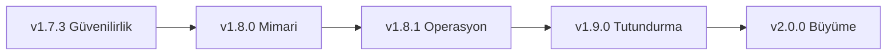

# CineFile — Aktif Ürün ve Teknik Yol Haritası

**Başlangıç noktası:** v1.7.2+12  
**Güncelleme tarihi:** 5 Ağustos 2026  
**Ana hedef:** CineFile'ı güvenli ve özellikli bir kişisel projeden, düzenli
kullanıma ve kontrollü büyümeye hazır güvenilir bir ürüne dönüştürmek.

Bu dosya bundan sonraki çalışmalar için tek aktif plan kaynağıdır. Eski sürüm
tarihçesi [`roadmap.md`](roadmap.md), ayrıntılı teknik denetim ise
[`AUDIT.md`](AUDIT.md) içinde korunur.

## Yol haritası ilkeleri

1. **Veri kaybı ve güvenlik, yeni özellikten önce gelir.**
2. **Bir faz bitmeden sonraki fazın büyük işine başlanmaz.** Bağımsız küçük
   işler istisnadır.
3. **Her iş test, kabul kriteri ve geri dönüş planıyla tamamlanır.**
4. **Temel günlük tutma ücretsiz ve güvenilir kalır.** Premium sınırı gelişmiş
   analiz, kişiselleştirme ve dışa aktarma çevresinde kurulur.
5. **Web birinci sınıf yayın yüzeyidir.** Her özellik web release derlemesinde
   doğrulanır; native platformlar ayrıca bozulmamalıdır.
6. **Yeni özellik eklemeden önce ölçüm sorusu sorulur:** Kullanıcı değerini,
   güvenilirliği veya sürdürülebilirliği nasıl artırıyor?

## Güncel durum

| Alan | Durum | Not |
|---|---|---|
| Firestore kimlik ve sosyal veri kuralları | ✅ Sağlamlaştırıldı | Yazar alanları ve takip sayaçları korunuyor; 58 kural testi geçiyor |
| Web koleksiyon kalıcılığı | ✅ Tamamlandı | Tarayıcı deposu, yedek geri yükleme ve web paylaşım aynası eklendi |
| Web release derlemesi | ✅ Geçiyor | Proxy modunda anahtar istemciye gömülmüyor |
| Test altyapısı | 🟡 İyi, geliştirilecek | Kapsam yaklaşık %48; süre ve eşik yönetimi eksik |
| Mimari | 🟡 Çalışıyor, yoğunlaşmış | Büyük provider/repository dosyaları değişiklik riskini artırıyor |
| App Check ve kötüye kullanım koruması | 🟠 Eksik | Firebase Console ve canlı geçiş planı gerektiriyor |
| Onboarding ve ürün ölçümü | 🟠 Eksik | İlk değer anı ve dönüşüm hunisi ölçülmüyor |

---

## Faz 1 — Güvenilirlik kapısı (v1.7.3)

**Amaç:** Kullanıcı verisi ve sosyal sayaçlar için kalan bütünlük boşluklarını
kapatmak; her yayın öncesinde hızlı ve güvenilir geri bildirim almak.

### P0 — yayın engelleyiciler

- [x] **Yorum sayacını yorum işlemiyle atomik bağla.**
  - Yorum ekleme/silme ile `commentCount` aynı batch içinde doğrulanmalı.
  - Sayaç negatif olamamalı ve bağımsız ±1 güncelleme reddedilmeli.
  - Hem `posts` hem `logs` alt koleksiyonları için negatif kural testleri olmalı.
  - **Tamamlandı (5 Ağustos 2026):** yorum kimliği işaretçisi ile create/delete
    geçişi `exists`/`existsAfter` üzerinden doğrulanıyor; bağımsız yorum veya
    sayaç yazımı reddediliyor. Firestore kural paketi 63/63 geçti.
- [x] **Web kalıcılığı için gerçek tarayıcı yenileme testi ekle.**
  - Koleksiyon oluştur → film ekle → sayfayı yenile → veriyi doğrula.
  - Paylaşımı aç → düzenle → Firestore aynasını doğrula → sil → aynanın
    silindiğini doğrula.
  - Bozuk yerel JSON uygulamanın açılmasını engellememeli.
  - **Tamamlandı (5 Ağustos 2026):** üretim başlangıç sırası düzeltildi ve
    `shared_preferences_web` açıkça kaydedildi. Gerçek tarayıcı harness'ında
    koleksiyon + film + ilişki, seed parametresi kaldırılıp sayfa yeniden
    yüklendikten sonra korundu. Bozuk JSON ile uygulamanın açıldığı doğrulandı;
    paylaşım/düzenleme/silme aynası da `collection_sharing_test.dart` ile geçti.
- [x] **Analiz/test yavaşlığını teşhis et.**
  - Test dosyası ve aşama bazında süre raporu üret.
  - Yerelde `flutter analyze` hedefi: sıcak önbellekte ≤60 saniye.
  - Tüm test paketi hedefi: CI'da ≤8 dakika; takılan test kalmamalı.
  - **Tamamlandı (5 Ağustos 2026):** sıcak analiz 11,07 sn, tüm test paketi
    29,12 sn sürdü; 251 test geçti ve takılma görülmedi. CI, proxy yolunda tüm
    paketi tekrarlamak yerine ilgili iki testi çalıştıracak şekilde daraltıldı.
    Her CI koşusu artık en yavaş 15 test dosyasını artifact olarak raporluyor.

### P1 — kalite kapısı

- [x] CI coverage tabanını güncelle ve başlangıç eşiği koy.
  - İlk eşik mevcut değerin altına düşmeyi engeller; hedef en az %50.
  - Yeni/yenilenen domain kodu için hedef ≥%80.
  - **Tamamlandı (5 Ağustos 2026):** başarılı CI raporunda genel coverage
    %50,67 (9.601/18.947), domain coverage %82,74 (532/643) ölçüldü. CI'a
    sırasıyla %50 ve %80 alt sınırlarını uygulayan kalite kapısı eklendi.
- [x] Web yerel depo sürümleme ve kota hatası davranışını test et.
  - **Tamamlandı (5 Ağustos 2026):** snapshot codec'i sürüm 1'i açıkça
    doğruluyor; eksik/eski ve gelecekteki bilinmeyen sürümler son geçerli
    snapshot'a güvenli dönüş yapıyor. Tarayıcı yazmasının `false` dönmesi veya
    kota istisnası artık tipli hata olarak çağırana iletiliyor ve başarısız
    snapshot depo tarafından kabul edilmiyor. Beş regresyon testi eklendi.
- [x] Backup import için bozuk tip, aşırı büyük dosya ve kısmi veri testleri ekle.
  - **Tamamlandı (5 Ağustos 2026):** içe aktarma tüm mutasyonlardan önce sürüm,
    bölüm tipi ve 5 MiB boyut sınırıyla doğrulanıyor. Bozuk alanlar kontrollü
    `BackupFormatException` üretiyor, skaler liste girdileri güvenle atlanıyor;
    kısmi backup web ve native tarafta eksik bölümleri silmeden birleştiriliyor.
    Beş yeni güvenlik testi eklendi.
- [x] Firestore kural testlerinde create/update/delete matrisini tamamla.
  - **Tamamlandı (5 Ağustos 2026):** Korunan tüm istemci yazma yüzeyleri
    `FIRESTORE_RULES_MATRIX.md` içinde belgelendi. Kullanıcı profili, gönderi,
    günlük, günlük yorumu, paylaşılan koleksiyon, kullanıcı adı, takip kenarı ve
    kullanıcıya özel alt koleksiyonlar için eksik olumlu/olumsuz create, update
    ve delete senaryoları eklendi. Emulator kural paketi 77/77 geçti.

### Faz 1 kabul kriterleri

- Firestore kural testlerinin tamamı geçer.
- İlgili Flutter testleri ve release web derlemesi geçer.
- Yenileme sonrası koleksiyon kaybı gerçek tarayıcı testinde tekrarlanamaz.
- Yorum/beğeni/takip sayaçları bağımsız istemci yazımıyla değiştirilemez.
- CI süre ve coverage sonuçlarını görünür biçimde raporlar.

---

## Faz 2 — Mimari sadeleştirme (v1.8.0)

**Amaç:** Yeni özelliklerin daha küçük değişikliklerle, daha az regresyon riskiyle
eklenebilmesini sağlamak. Bu faz kullanıcı davranışını bilinçli olarak değiştirmez.

### İş paketleri

- [x] **`database_provider.dart` dosyasını böl.**
  - `watch_record_providers.dart`
  - `movie_settings_providers.dart`
  - `collection_providers.dart`
  - `follow_repository.dart`
  - Firestore mapper ve sorgu yardımcıları
  - **Tamamlandı (5 Ağustos 2026):** Dışarıdan kullanılan
    `database_provider.dart` giriş noktası korunarak izleme kayıtları, film
    ayarları, koleksiyonlar ve takip işlemleri dört `part` dosyasına ayrıldı.
    Ana dosya 913 satırdan 43 satıra indi; en büyük parça 366 satırda kaldı.
    Mevcut importlar ve public provider/action yüzeyi değişmedi. Statik analiz,
    261 Flutter testi, 77 Firestore kural testi ve release web derlemesi geçti.
- [x] **`insights_provider.dart` hesaplarını domain servislerine taşı.**
  - Saf hesaplama fonksiyonları UI/Riverpod'dan bağımsız test edilmeli.
  - Provider yalnızca veri toplama ve sonuç birleştirme yapmalı.
  - **Tamamlandı (5 Ağustos 2026):** Özet, trend, dağılım, ısı haritası ve
    seri hesapları 226 satırlık `InsightsCalculator` domain servisine taşındı;
    provider 890 satırdan 161 satıra indi. Yerelleştirilmiş rozet kataloğu ayrı
    561 satırlık servise ayrıldı. Hesaplayıcı Riverpod/Firebase olmadan ve sabit
    saat girdisiyle iki doğrudan domain testinde doğrulandı. Tam Flutter paketi,
    77 Firestore testi ve release web derlemesi geçti.
- [x] **TMDb servis yüzeyini kaynaklara ayır.**
  - Arama/keşif, detay, kişi/krediler ve sezon endpoint grupları.
  - Ortak hata eşleme ve proxy davranışı tek katmanda kalmalı.
  - **Tamamlandı (5 Ağustos 2026):** `TmdbService` uyumlu cephe olarak
    korunurken yöntemler arama/keşif, detay/izleme sağlayıcıları, kişi/krediler
    ve sezon kaynaklarına ayrıldı. Ortak Dio, dil, API anahtarı, proxy ve demo
    verisi 139 satırlık çekirdekte kaldı; en büyük kaynak 375 satırdır. Proxy
    allowlist testi tüm kaynak dosyalarını tarayacak şekilde genişletildi. Tam
    Flutter paketi, 77 Firestore testi, analiz ve release web derlemesi geçti.
- [x] İzleme kaydı yazma işlemlerini widget'lardan repository/use-case katmanına taşı.
  - 5 Ağustos 2026: Oluşturma, güncelleme ve silme işlemleri
    `WatchRecordService` altında birleştirildi; widget'lar Firestore transaction ve
    yerel repository ayrıntılarından ayrıldı. Bölüm ilerlemesi, izleme sayacı ve
    web/native fallback davranışı korundu. 263 Flutter testi geçti (1 bilinçli
    skip); 77 Firestore kural testi, tam analiz ve release web derlemesi temiz.
- [ ] Web/native repository davranış sözleşmesi için ortak karakterizasyon testleri yaz.
- [ ] Sessiz hata yakalama noktalarını gözden geçir; kullanıcı mesajı, gözlemleme
  veya bilinçli ignore seçeneklerinden biri açıkça seçilsin.

### Faz 2 kabul kriterleri

- Ana provider ve servis dosyalarının hiçbiri 600 satırı aşmaz; hedef 400 satırdır.
- Domain hesapları Firebase, Flutter widget ve Riverpod olmadan test edilebilir.
- Mevcut kullanıcı akışları ve yedek formatı değişmez.
- Tam test paketi, kural testleri ve web release derlemesi geçer.

---

## Faz 3 — Güvenlik ve operasyon (v1.8.1)

**Amaç:** Uygulamayı otomatik kötüye kullanım, üretim hataları ve geri döndürme
senaryolarına karşı hazırlamak.

### İş paketleri

- [ ] **Firebase App Check geçiş planı hazırla.**
  - Önce ölçüm/enforcement kapalı mod.
  - Web için reCAPTCHA Enterprise veya uygun provider.
  - Geçerli kullanıcıların reddedilme oranı ölçüldükten sonra enforcement.
- [ ] TMDb proxy rate limitini atomik altyapıya taşı.
  - Cloudflare Durable Object veya resmi Rate Limiting.
  - IP, origin ve anormal trafik gözlemi.
- [ ] Sentry release adı, commit ve ortam etiketlerini yayın akışına ekle.
- [ ] Canlılık kontrolü: Firebase init, TMDb proxy ve temel arama için sentetik test.
- [ ] Firestore yedekleme ve geri dönüş prosedürünü yazılı hâle getir.
- [ ] Yayın geri alma prosedürü ve son sağlıklı `gh-pages` artefaktı tanımla.
- [ ] Bağımlılık ve gizli bilgi taramasını CI'a ekle.

### Faz 3 kabul kriterleri

- App Check enforcement öncesi ölçüm sonucu kaydedilmiş olur.
- Proxy paralel isteklerle kolayca aşılamayan bir kota uygular.
- Bir üretim hatası ilgili commit ve sürümle ilişkilendirilebilir.
- Yazılı ve denenmiş bir rollback akışı bulunur.

---

## Faz 4 — Kullanıcı deneyimi ve tutundurma (v1.9.0)

**Amaç:** Yeni kullanıcının ilk değer anına hızla ulaşması ve uygulamaya geri
dönmek için net nedenler bulması.

### İş paketleri

- [ ] **Kısa onboarding akışı.**
  - Dil/bölge seçimi.
  - İlk üç favori veya izlenen yapımı ekleme.
  - Günlük, bölüm takibi ve gizlilik modelini kısa anlatım.
- [ ] Boş ekranları eyleme dönük hâle getir.
  - “İlk kaydını ekle”, “koleksiyon oluştur”, “arkadaş bul” girişleri.
- [ ] İlk oturum kontrol listesi ve ilerleme göstergesi.
- [ ] Arama → detay → kayıt ekleme yolundaki gereksiz adımları ölç ve azalt.
- [ ] Erişilebilirlik turu.
  - Semantics etiketleri, klavye gezinmesi, odak sırası.
  - Metin ölçekleme, minimum dokunma alanı ve renk kontrastı.
- [ ] Hata/çevrimdışı durumlarını ortak UI bileşenlerine bağla.
- [ ] Gizlilik merkezi: hangi verinin yerel, bulut veya herkese açık olduğunu
  kullanıcıya tek ekranda göster.

### Ölçülecek ürün metrikleri

- Onboarding tamamlama oranı.
- İlk izleme kaydına kadar geçen süre.
- İlk gün en az bir koleksiyon oluşturan kullanıcı oranı.
- 7 ve 30 günlük geri dönüş oranı.
- Arama → detay ve detay → kayıt dönüşüm oranları.

### Faz 4 kabul kriterleri

- Yeni kullanıcı rehbersiz olarak ilk kaydını oluşturabilir.
- Temel akışlar klavye ve ekran okuyucuyla tamamlanabilir.
- Analitik olayları kişisel izleme içeriği veya notları toplamaz.
- Ürün metrikleri sürüm öncesinde gizlilik incelemesinden geçer.

---

## Faz 5 — Ürün büyümesi ve premium hazırlığı (v2.0.0)

**Amaç:** Temel günlük deneyimini bozmadan paylaşılabilir değer ve sürdürülebilir
gelir seçenekleri oluşturmak.

### Öncelikli ürün işleri

- [ ] **CineFile Wrapped:** yıllık özet, PNG/story dışa aktarma ve isteğe bağlı
  topluluk paylaşımı.
- [ ] Gelişmiş öneriler: tür, yönetmen, oyuncu ve izleme geçmişi açıklamasıyla
  şeffaf öneri nedeni.
- [ ] Koleksiyon şablonları ve dışa aktarılabilir poster kartları.
- [ ] Gelişmiş analiz filtreleri: yıl, film/dizi, tür ve platform.
- [ ] Hesap/veri silme ve taşınabilirlik akışını ürün seviyesinde tamamla.

### Premium için önerilen sınır

**Ücretsiz kalmalı:** izleme kaydı, temel bölüm takibi, temel koleksiyonlar,
yedek alma ve gizlilik kontrolleri.

**Premium adayı:** gelişmiş analizler, sınırsız özel görünüm/tema, yüksek
çözünürlüklü dışa aktarma, gelişmiş Wrapped kartları ve koleksiyon şablonları.

### v2.0 kabul kriterleri

- Faz 1–4 kalite kapıları korunur.
- Premium olmadan temel günlük deneyimi eksiksizdir.
- Satın alma geri yükleme ve hata senaryoları testlidir.
- Mağaza gizlilik beyanları gerçek veri davranışıyla uyumludur.

---

## Zamanlanmamış backlog

Bu maddeler değerlidir ancak aktif fazlardan birinin önüne geçmez:

- Moderasyon paneli ve kullanıcı şikâyet akışı.
- Cloud Functions ile önceden hesaplanan istatistik özetleri.
- Çok büyük günlükler için sayfalı liste + ayrı toplam istatistik veri yolu.
- Force-directed graph hesaplamasını isolate/worker'a taşıma.
- Takvim görünümünü yeni ürün gerekçesiyle yeniden tasarlama.
- Arkadaşlarla ortak koleksiyon düzenleme.
- İçe/dışa aktarma için CSV ve Letterboxd uyumluluğu.
- Android/iOS mağaza yayın süreçleri.

## Uygulama sırası

## Çalışma ve yayın protokolü

Her görev aşağıdaki sırayla ilerler:

1. Problem ve kullanıcı etkisi yazılır.
2. Kabul kriterleri netleştirilir.
3. İlgili regresyon testi mümkünse düzeltmeden önce eklenir.
4. En küçük güvenli değişiklik uygulanır.
5. İlgili testler, kural testleri ve gereken platform derlemesi çalıştırılır.
6. `main` dalına açıklayıcı commit gönderilir.
7. Web'i etkileyen değişiklik `gh-pages` üzerinde yayımlanır.
8. Bu dosyadaki görev kutusu ve doğrulama notu güncellenir.

## Bir sonraki görev

**Faz 2 / Görev 5:** Web/native repository davranış sözleşmesi için ortak karakterizasyon testleri yazmak.

Tamamlanma kanıtı:

- Aynı ortak sözleşme testi web ve native repository uygulamalarına karşı çalışır.
- Koleksiyon, ayar ve izleme kaydı davranışlarının eşdeğerliği doğrulanır.
- Mevcut yedek formatı ve kullanıcı akışları değişmez.
- Tam Flutter testi, Firestore kural paketi ve web release derlemesi geçer.
