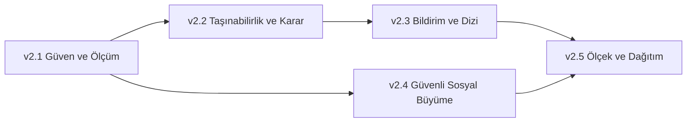

# CineFile — v2.1 ve Sonrası Ürün Yol Haritası

**Plan tarihi:** 11 Ağustos 2026

**Kod tabanı sürümü:** `2.0.0+13`

**Plan ufku:** v2.1–v2.5
**Ana hedef:** CineFile'ı güçlü bir kişisel izleme günlüğünden; ölçülebilir,
taşınabilir, güvenli ve kullanıcıların düzenli olarak geri döndüğü bir ürüne
dönüştürmek.

Bu dosya bundan sonraki çalışmalar için tek aktif plan kaynağıdır. Tamamlanan
eski sürümler ve kararlar [`HISTORY.md`](HISTORY.md), teknik denetim notları ise
[`AUDIT.md`](../architecture/AUDIT.md) içinde korunur.

## Ürün yönü

CineFile üç temel vaadi birlikte sunar:

1. **Hatırla:** Film, dizi ve bölüm geçmişini güvenle kaydet.
2. **Anla:** İzleme alışkanlıklarını ve sinema zevkini anlamlandır.
3. **Paylaş:** İstediğin kayıtları, listeleri ve keşifleri kontrollü biçimde
   arkadaşlarınla paylaş.

Yeni bir iş bu vaatlerden en az birini belirgin biçimde güçlendirmiyorsa aktif
plana alınmaz.

## Başlangıç noktası

Tamamlanmış ürün temeli:

- Film/dizi günlüğü, tekrar izleme ve sezon/bölüm ilerlemesi
- Arama, keşif, yayın platformu bilgileri ve açıklanabilir öneriler
- Koleksiyonlar, hazır şablonlar ve yerleşik izleme listesi
- İçgörüler, başarımlar, ilişki grafiği, Cine Twin ve CineFile Wrapped
- Topluluk akışı, takip, yorum, beğeni ve koleksiyon paylaşımı
- Türkçe/İngilizce arayüz, onboarding ve erişilebilirlik temeli
- JSON yedekleme, gizlilik merkezi, Sentry ve sentetik sağlık kontrolü
- Firestore güvenlik testleri, web kalıcılığı ve TMDb proxy koruması

Bilinen açık işler:

- Paket, arayüz, yayın ve hata raporlama sürümleri CI tarafından eşleştiriliyor.
- CI'da bağımlılık ve gizli bilgi taraması henüz yok.
- Onboarding ve temel dönüşüm akışları ürün metriği olarak ölçülmüyor.
- Topluluk için kullanıcı şikâyeti, engelleme ve moderasyon kuyruğu yok.
- Haricî servislerden geçmiş içe aktarma desteklenmiyor.
- Bildirimler tek bir uygulama içi merkezde toplanmıyor.
- Büyük günlükler için sayfalama ve artımlı istatistik hesaplama yok.

## Yol haritası ilkeleri

1. Veri güvenliği ve geri alınabilirlik, yeni özellikten önce gelir.
2. Kişisel notlar, izlenen yapım adları ve günlük içeriği analitik sistemine
   gönderilmez.
3. Temel günlük, bölüm takibi, yedekleme ve gizlilik kontrolleri ücretsiz kalır.
4. Web birinci sınıf yayın yüzeyidir; mobil platformlar bozulmadan korunur.
5. Her özellik ölçülebilir bir kullanıcı sonucuna ve açık kabul kriterlerine
   sahip olur.
6. Büyük özellikler önce dar ve güvenilir bir sürümle yayınlanır.

---

## Faz 1 — Güven, ölçüm ve sürüm disiplini (v2.1)

**Amaç:** Yeni büyüme çalışmalarından önce ürünün güvenliğini, sürüm kimliğini
ve kullanıcı akışlarının ölçülebilirliğini tamamlamak.

### P0 — yayın kapısı

- [x] **Sürüm ve dokümantasyon kimliğini hizala.**
  - Gerçek yayın kapsamına göre `pubspec.yaml` sürümünü belirle.
  - Web release, Sentry release ve dokümantasyon aynı sürümü göstermeli.
  - Yayın notu şablonu ve yükseltme notu oluşturulmalı.
  - **Tamamlandı (12 Ağustos 2026):** Ürün kapsamı `2.0.0+13` olarak
    sürümlendi. Ayarlar ekranı `2.0.0` gösteriyor; CI ve deploy akışı
    `tool/check_version_sync.dart` ile iki kaynağın ayrışmasını engelliyor.
    Sentry ve rollback belgelerindeki örnek sürümler güncellendi.
- [x] **CI'a bağımlılık ve gizli bilgi taraması ekle.**
  - Dart/Flutter, npm ve GitHub Actions bağımlılıkları kapsanmalı.
  - Yeni bir anahtar veya token commit edilirse kontrol başarısız olmalı.
  - Yanlış pozitifler belgeli allowlist dışında sessizce geçilmemeli.
  - **Tamamlandı (12 Ağustos 2026):** Depoya özel tarayıcı; özel anahtar,
    sağlayıcı token'ı, uzun kimlik bilgisi ataması ve TMDb anahtarı desenlerini
    izlenen metin dosyalarında engelliyor. Firebase web API kimlikleri açık
    istemci yapılandırması oldukları için kapsam dışında tutuldu. Belgeli dosya
    istisnaları geçmiş sızıntıyı açıklayan denetim raporu ile imza/fixture
    taşıması zorunlu tarayıcının kendisidir. CI iki npm
    kilit dosyasını yüksek/kritik güvenlik açıkları için denetliyor, pull
    request'lerde yeni riskli bağımlılıkları reddediyor. Dependabot; pub, iki npm
    paketi ve GitHub Actions için haftalık güncelleme takibi yapıyor.
- [ ] **App Check monitoring sonucunu kaydet ve enforcement kararını ver.**
  - Meşru trafik doğrulama oranı belgelenmeli.
  - Web ve desteklenen native platformlar ayrı değerlendirilmelidir.
  - Eşik sağlanmıyorsa enforcement açılmadan neden ve takip işi yazılmalı.
  - **Yayın öncesi karar (12 Ağustos 2026):** Provider kaydı ve token üreten web
    istemcisi yayımlandı. Uygulamada henüz anlamlı gerçek kullanıcı trafiği
    olmadığı için yedi günlük oran hesaplamak veya enforcement açmak güvenilir
    değildir. Firestore ve Authentication enforcement kapalı kalacaktır. Gerçek
    kullanıcı trafiği başladıktan sonra yedi tam günlük ölçüm alınacak ve karar
    [`APP_CHECK_ROLLOUT_LOG.md`](../firebase/APP_CHECK_ROLLOUT_LOG.md) içine
    kaydedilecektir. Bu bekleme v2.1 geliştirmelerini engellemez.

### P1 — yayın öncesi gizlilik ve ölçüm hazırlığı

- [x] **Ürün olay sözleşmesini tanımla.**
  - Onboarding tamamlandı.
  - İlk izleme kaydı oluşturuldu.
  - Arama → detay → kayıt adımları tamamlandı.
  - İlk koleksiyon oluşturuldu.
  - Wrapped görüntülendi veya paylaşıldı.
  - Olay şemasında yapım adı, TMDb kimliği, not, yorum veya serbest metin
    bulunmamalı.
  - **Tamamlandı (12 Ağustos 2026):** İzin verilen yedi olay kod seviyesinde
    sınırlandırıldı ve parametresiz tutuldu. Sözleşme
    [`PRODUCT_ANALYTICS.md`](../privacy/PRODUCT_ANALYTICS.md) içinde belgelendi.
- [x] **Analitik için açık gizlilik kontrolü ekle.**
  - Kullanıcı ölçümü kapatabilmeli.
  - Tercih cihazda saklanmalı ve Gizlilik Merkezi'nden değiştirilebilmeli.
  - Geliştirme/test ortamı üretim metriklerini kirletmemeli.
  - **Tamamlandı (12 Ağustos 2026):** Ölçüm varsayılan kapalı ve açık izne bağlı
    hâle getirildi. Tercih cihazda saklanıyor; geliştirme/test sürümleri izin
    açık olsa bile olay gönderemiyor. Gizlilik Merkezi'ne iki dilde kontrol ve
    açıklama eklendi.
- [x] **Ölçüm akışını kontrollü pilotla doğrula.**
  - Geliştirici/test olaylarının üretim verisine karışmadığını doğrula.
  - Onboarding → ilk kayıt ve arama → detay → kayıt zincirini birkaç kontrollü
    test hesabıyla uçtan uca çalıştır.
  - Olayların yalnızca açık izin verildiğinde gönderildiğini kanıtla.
  - Gerçek kullanıcı trafiği oluşana kadar dönüşüm ve geri dönüş hedefi koyma.
  - **Kod hazırlığı (12 Ağustos 2026):** Temel olaylar gerçek başarı noktalarına
    bağlandı ve izin davranışı otomatik testlerle doğrulandı. Canlı release
    adımları [`ANALYTICS_PILOT.md`](../privacy/ANALYTICS_PILOT.md) içinde takip
    ediliyor.
  - **Tamamlandı (13 Ağustos 2026):** Canlı arama → detay → ilk kayıt zinciri
    başarıyla çalıştırıldı. Özel olaylar Firebase Realtime'da doğrulandı;
    kişisel içerik taşımadığı ve pilot sonunda iznin kapatıldığı kaydedildi.

### Yayın sonrasına ertelenen ölçümler

Aşağıdaki metrikler uygulama gerçek kullanıcılarla yayınlandıktan ve yeterli örnek
oluştuktan sonra etkinleştirilecektir:

- Onboarding tamamlama oranı
- İlk kayda kadar geçen süre
- Arama → detay ve detay → kayıt dönüşümü
- 7 ve 30 günlük geri dönüş

### v2.1 kabul kriterleri

- Release, hata raporu ve dokümantasyon aynı sürüm kimliğini taşır.
- CI gizli bilgi veya kritik bağımlılık bulgusunda yayını durdurur.
- Ölçüm kapalıyken hiçbir ürün olayı gönderilmez.
- Analitik yüklerinde kişisel izleme içeriği bulunmadığı test edilir.
- Kontrollü pilot olayları görüntülenebilir ve kişisel içerik taşımadığı
  doğrulanmıştır.
- Gerçek kullanıcı metriği gerektiren hedefler ilk genel/kapalı test yayınına
  kadar yayın kapısı sayılmaz.

---

## Faz 2 — Veri taşınabilirliği ve karar desteği (v2.2)

**Amaç:** Yeni kullanıcının mevcut arşivini CineFile'a kolayca taşımasını ve
izleyeceği yapımı daha hızlı seçmesini sağlamak.

### P0 — Letterboxd/CSV içe aktarma

- [x] **Letterboxd CSV dosyasını önizle ve doğrula.**
  - Dosya boyutu, sütunlar, tarih ve puan biçimleri yazmadan önce doğrulanmalı.
  - Kaç satırın geçerli veya hatalı olduğu gösterilmeli; eşleşme durumu sonraki
    TMDb adımında eklenmeli.
  - **Tamamlandı (13 Ağustos 2026):** Ayarlar'a yazma yapmayan Letterboxd CSV
    önizlemesi eklendi. UTF-8, 5 MiB/10.000 satır sınırı, zorunlu sütunlar,
    tarih, yıl ve puan doğrulaması ile satır bazlı hata özeti otomatik testli.
- [x] **TMDb eşleştirme ve kullanıcı düzeltme akışı ekle.**
  - Başlık + yıl ile güven skoru üretilmeli.
  - Belirsiz sonuçlar kullanıcı onayı olmadan kaydedilmemeli.
  - Film/dizi ayrımı korunmalı.
  - **Tamamlandı (13 Ağustos 2026):** Geçerli CSV satırları başlık + yıl güven
    skoruyla TMDb'ye eşleniyor. Güçlü sonuçlar otomatik seçiliyor; belirsiz
    sonuçlar film/dizi ayrımı korunarak kullanıcı onayına sunuluyor. Bu aşama
    hâlâ yalnızca önizleme yapıyor ve kalıcı kayıt oluşturmuyor.
- [ ] **Yinelenen kayıt politikası ekle.**
  - Tekrar izlemeler korunmalı.
  - Birebir aynı tarih/yapım kaydı için atla, birleştir veya ekle seçenekleri
    sunulmalı.
  - İçe aktarma işlemi hata durumunda kısmi ve belirsiz bir sonuç bırakmamalı.
- [ ] **CineFile CSV dışa aktarma ekle.**
  - İnsan tarafından okunabilir ve yeniden içe aktarılabilir olmalı.
  - JSON yedekleme temel ve eksiksiz kurtarma biçimi olarak korunmalı.

### P1 — “Bu akşam ne izlesem?”

- [ ] **Kısa tercih akışı oluştur.**
  - Ruh hâli, kullanılabilir süre, film/dizi ve yayın platformu seçenekleri
  - Daha önce izlenenleri ve istenmeyen türleri dışlama
  - En fazla üç güçlü sonuç
- [ ] **Her önerinin nedenini açıkla.**
  - Tür, oyuncu/yönetmen, süre, platform ve geçmiş tercih sinyalleri
  - Kullanılmayan veya eksik veri açıkça belirtilmeli.
- [ ] **Sonuç geri bildirimi ekle.**
  - “İlgimi çekti”, “bunu önerme” ve “başka öner” sinyalleri
  - Swipe Discovery tercihleriyle aynı veri sözleşmesini kullanmalı.

### v2.2 kabul kriterleri

- Örnek Letterboxd arşivleri kayıt, puan ve tekrar izlemeleri kaybetmeden içe
  aktarılır.
- Kullanıcı, kalıcı yazmadan önce değişiklik özetini görebilir ve vazgeçebilir.
- Yinelenen kayıt ve hatalı eşleşme senaryoları otomatik testlidir.
- Karar modu seçilen filtrelere uyan en fazla üç açıklanabilir sonuç üretir.
- İçe aktarma ve öneri akışlarının temel dönüşüm olayları ölçülebilir.

---

## Faz 3 — Geri dönüş ve dizi deneyimi (v2.3)

**Amaç:** Kullanıcıya rahatsız etmeden, doğru zamanda uygulamaya dönmesi için
anlamlı nedenler sunmak.

### P0 — uygulama içi bildirim merkezi

- [ ] **Birleşik bildirim veri modeli oluştur.**
  - Yorum, beğeni, takip ve yeni bölüm olayları
  - Okundu/okunmadı durumu ve toplu temizleme
  - Her bildirim ilgili ekranı güvenli biçimde açmalı.
- [ ] **Bildirim tercihlerini ayrıntılandır.**
  - Sosyal, bölüm, hedef ve hatırlatma kategorileri ayrı açılıp kapanabilmeli.
  - Varsayılanlar düşük gürültülü olmalı.
- [ ] **Web için uygulama içi merkezi yayınla.**
  - Push izni istenmeden önce merkez kendi başına kullanılabilir olmalı.
  - Mobil push daha sonra aynı veri modeli üzerine eklenmeli.

### P1 — gelişmiş dizi takibi

- [ ] Ana ekrana **Sıradaki Bölüm** kartı ekle.
- [ ] Dizi durumu ekle: izliyorum, ara verdim, bıraktım, tamamladım.
- [ ] Yeni bölüm ve sezon prömiyeri takvimi ekle.
- [ ] Sezon tamamlama ve sezona toplu puan verme akışını geliştir.
- [ ] Bölüm yorumlarında varsayılan spoiler koruması uygula.
- [ ] İzleme hızına göre isteğe bağlı bitirme tahmini göster.

### P2 — paylaşılabilir kart sistemi

- [ ] Film puanı ve kısa yorum kartı
- [ ] Aylık izleme özeti
- [ ] Başarım ve Cine Twin uyum kartı
- [ ] Koleksiyon kapağı
- [ ] Story ve kare çıktı oranları
- [ ] Paylaşmadan önce kişisel alanların görünürlük önizlemesi

### v2.3 kabul kriterleri

- Bildirimler yinelenmeden oluşturulur ve okunma durumu cihazlar arasında
  tutarlı kalır.
- Kullanıcı her bildirim kategorisini bağımsız kapatabilir.
- Sıradaki bölüm hesabı özel bölümler ve sezon geçişlerinde doğru çalışır.
- Paylaşım kartı varsayılan olarak kişisel not veya gizli kayıt bilgisi içermez.
- Bildirimlerin geri dönüşe etkisi ölçülebilir; içerik ayrıntısı ölçülmez.

---

## Faz 4 — Güvenli sosyal büyüme (v2.4)

**Amaç:** Topluluk özelliklerini kullanıcı güvenliği ve gerçek işbirliğiyle
genişletmek.

### P0 — güvenlik ve moderasyon

- [ ] Gönderi, yorum, koleksiyon ve kullanıcı şikâyeti ekle.
- [ ] Kullanıcı engelleme ve sessize alma ekle.
- [ ] Spoiler ve spam için ayrı şikâyet nedenleri tanımla.
- [ ] Yetkili kullanıcılar için moderasyon kuyruğu oluştur.
- [ ] Tekrarlanan kötüye kullanım için oran sınırı ve denetim izi ekle.
- [ ] Firestore kurallarını rol yükseltme ve sahte moderasyon işlemlerine karşı
  negatif testlerle koru.

### P1 — ortak koleksiyonlar

- [ ] Koleksiyona bağlantı veya kullanıcı adıyla davet gönderme
- [ ] Sahip, düzenleyici ve görüntüleyici rolleri
- [ ] Film ekleme, çıkarma ve sıralama için etkinlik geçmişi
- [ ] Eşzamanlı düzenlemede çakışma davranışı
- [ ] “Bu akşam ne izleyelim?” kısa liste ve oylama modu
- [ ] Üyelikten ayrılma, yetki kaldırma ve koleksiyon silme akışları

### v2.4 kabul kriterleri

- Engellenen kullanıcıların içerikleri ve etkileşimleri iki yönde gizlenir.
- Şikâyetler yalnızca yetkili moderatörler tarafından görülebilir.
- Ortak koleksiyon rolleri istemci değişikliğine güvenmeden sunucu kurallarıyla
  uygulanır.
- Çakışan düzenlemeler veri kaybı veya bozuk sıralama üretmez.
- Oylama sonucu oy değişiklikleri ve üyelikten ayrılma sonrasında tutarlıdır.

---

## Faz 5 — Ölçek, çevrimdışı deneyim ve dağıtım (v2.5)

**Amaç:** Büyük arşivlerde performansı korumak ve CineFile'ı kurulabilir/mobil
bir ürün olarak yayınlamaya hazırlamak.

### P0 — büyük günlük performansı

- [ ] Günlük ekranına kararlı sayfalama ekle.
- [ ] Toplam istatistikleri sayfalı listeden ayır ve artımlı hesapla.
- [ ] İlişki grafiği hesabını isolate/web worker'a taşı.
- [ ] 1.000, 5.000 ve 10.000 kayıtlık performans senaryoları oluştur.
- [ ] Büyük içe aktarma ve yedeklerde ilerleme, iptal ve güvenli geri dönüş ekle.

### P1 — PWA ve çevrimdışı kullanım

- [ ] PWA kurulum yönlendirmesi ve güncelleme bildirimi
- [ ] Ağ yokken açılış ve son veriye erişim
- [ ] Çevrimdışı yazma kuyruğu ve çakışma politikası
- [ ] Film, profil ve koleksiyonlar için deep link
- [ ] Önbellek boyutu ve temizleme kontrolü

### P2 — mobil yayın hazırlığı

- [ ] Android kapalı test yayını
- [ ] Mağaza gizlilik beyanlarını gerçek veri davranışıyla eşleştirme
- [ ] Hesap silme ve satın alma geri yükleme senaryoları
- [ ] Mobil push bildirimleri
- [ ] Mağaza ekran görüntüleri, açıklamaları ve destek bağlantıları
- [ ] iOS yayını için maliyet ve bakım kararı

### v2.5 kabul kriterleri

- 10.000 kayıtlık günlükte temel gezinme ve kayıt ekleme kabul edilen performans
  bütçesini aşmaz.
- Çevrimdışı oluşturulan kayıt bağlantı geri geldiğinde tek kez senkronize olur.
- Yeni web sürümü kullanıcı verisi kaybetmeden güncellenebilir.
- Android kapalı testte oturum, kayıt, yedek ve bildirim akışları doğrulanır.
- Mağaza beyanları ile Gizlilik Merkezi aynı veri envanterini kullanır.

---

## Başarı göstergeleri

Her sürüm kendi işlevini teslim etmenin yanında aşağıdaki ürün sonuçlarından en
az birini iyileştirmelidir:

| Gösterge | Neyi anlatır |
|---|---|
| İlk kayda kadar geçen süre | İlk değer anının ne kadar hızlı olduğu |
| İçe aktarmayı tamamlama oranı | Mevcut kullanıcıların geçiş engelinin azalıp azalmadığı |
| 7/30 günlük geri dönüş | Ürünün düzenli kullanım değeri |
| Öneriden kayda dönüşüm | Keşif ve karar desteğinin kalitesi |
| Bildirimden anlamlı eyleme dönüşüm | Bildirimlerin yararlı olup olmadığı |
| Şikâyet çözüm süresi | Topluluk güvenliği operasyonunun sağlığı |
| Büyük günlük işlem süresi | Ürünün uzun vadeli kullanıcıyı taşıyabilmesi |

Başlangıç değerleri gerçek kullanıcı trafiği oluştuktan sonra belirlenecek; yayın
öncesinde yalnızca olayların doğruluğu, gizliliği ve izin davranışı test
edilecektir. Veri görülmeden büyüme hedefi konulmayacaktır.

## Öncelik ve bağımlılık sırası

Faz içindeki P0 işleri yayın kapısıdır. Bağımsız P1/P2 işleri, P0'ın veri
modelini veya güvenlik kararını geçersiz kılmıyorsa paralel ilerleyebilir.

## Zamanlanmamış backlog

- Trakt ve IMDb'ye özel içe aktarma bağlayıcıları
- Doğal dille günlük ve koleksiyon araması
- Arkadaş grupları ve özel izleme kulüpleri
- Takvim görünümünün ürün odaklı yeniden tasarımı
- Açık tema ve gelişmiş kişiselleştirme
- Android/iOS ana ekran widget'ları
- Premium paket ve ödeme altyapısı
- Kullanıcının açık onayıyla yapay zekâ destekli sinema zevki özeti

## Premium sınırı

**Ücretsiz kalmalı:** izleme kaydı, temel bölüm takibi, temel koleksiyonlar,
standart içe/dışa aktarma, yedekleme, bildirim kontrolleri, engelleme/şikâyet ve
gizlilik merkezi.

**Premium adayı:** gelişmiş analiz görünümleri, yüksek çözünürlüklü özel kartlar,
gelişmiş tema seçenekleri, premium koleksiyon şablonları ve isteğe bağlı ileri
seviye kişiselleştirme.

Premium uygulaması ayrı bir ürün kararıdır; ödeme altyapısı eklenmeden önce değer
önerisi kullanıcı araştırmasıyla doğrulanmalıdır.

## Çalışma ve yayın protokolü

Her görev aşağıdaki sırayla ilerler:

1. Kullanıcı problemi ve beklenen sonuç yazılır.
2. Gizlilik, güvenlik ve veri göçü etkisi değerlendirilir.
3. Kabul kriterleri ve ölçüm olayı netleştirilir.
4. İlgili regresyon testi mümkünse uygulamadan önce eklenir.
5. En küçük güvenli değişiklik uygulanır.
6. İlgili Flutter testleri, Firestore kuralları, analiz ve gereken platform
   derlemesi çalıştırılır.
7. Geri dönüş veya özellik bayrağı yaklaşımı doğrulanır.
8. Yol haritası kutusu yalnızca kabul kriterleri sağlandığında tamamlanır.

## Sıradaki iş

**v2.2 / P0 — Yinelenen kayıt politikası.**

v2.1'in yayın öncesi geliştirme ve kontrollü pilot işleri tamamlandı. App Check
gerçek trafik gözlemi yayın sonrasında ayrı takip edilecek ve enforcement o
zamana kadar kapalı kalacak. Letterboxd CSV önizleme ve biçim doğrulama
tamamlandı. TMDb eşleştirme ve kullanıcı düzeltme akışı da hazır. Sonraki aktif
geliştirme, tekrar izlemeleri koruyan ve aynı tarih/yapım çakışmalarında kullanıcıya
atla, birleştir veya ekle seçeneklerini sunan yinelenen kayıt politikasıdır.
