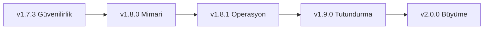

# CineFile — Aktif Ürün ve Teknik Yol Haritası

**Başlangıç noktası:** v1.7.2+12  
**Güncelleme tarihi:** 5 Ağustos 2026  
**Ana hedef:** CineFile'ı güvenli ve özellikli bir kişisel projeden, düzenli
kullanıma ve kontrollü büyümeye hazır güvenilir bir ürüne dönüştürmek.

Bu dosya bundan sonraki çalışmalar için tek aktif plan kaynağıdır. Eski sürüm
tarihçesi [`HISTORY.md`](HISTORY.md), ayrıntılı teknik denetim ise
[`AUDIT.md`](../architecture/AUDIT.md) içinde korunur.

## Yol haritası ilkeleri

1. **Veri kaybı ve güvenlik, yeni özellikten önce gelir.**
2. **Bir faz bitmeden sonraki fazın büyük işine başlanmaz.** Bağımsız küçük
   işler istisnadır.
3. **Her iş test, kabul kriteri ve geri dönüş planıyla tamamlanır.**
4. **Temel günlük tutma ücretsiz ve güvenilir kalır.** Premium sınırı gelişmiş
   analiz, kişiselleştirme ve dışa aktarma çevresinde kurulur.
5. **Web birinci sınıf yayın yüzeyidir.** Her özellik web release derlemesinde
   doğrulanır; native platformlar ayrıca bozulmamalıdır.
6. **Yeni özellik eklemeden önce ölçüm sorusu sorulur:** Kullanıcı değerini,
   güvenilirliği veya sürdürülebilirliği nasıl artırıyor?

## Güncel durum

| Alan | Durum | Not |
|---|---|---|
| Firestore kimlik ve sosyal veri kuralları | ✅ Sağlamlaştırıldı | Yazar alanları ve takip sayaçları korunuyor; 58 kural testi geçiyor |
| Web koleksiyon kalıcılığı | ✅ Tamamlandı | Tarayıcı deposu, yedek geri yükleme ve web paylaşım aynası eklendi |
| Web release derlemesi | ✅ Geçiyor | Proxy modunda anahtar istemciye gömülmüyor |
| Test altyapısı | 🟡 İyi, geliştirilecek | Kapsam yaklaşık %48; süre ve eşik yönetimi eksik |
| Mimari | 🟡 Çalışıyor, yoğunlaşmış | Büyük provider/repository dosyaları değişiklik riskini artırıyor |
| App Check ve kötüye kullanım koruması | 🟠 Eksik | Firebase Console ve canlı geçiş planı gerektiriyor |
| Onboarding ve ürün ölçümü | 🟠 Eksik | İlk değer anı ve dönüşüm hunisi ölçülmüyor |

---

## Faz 1 — Güvenilirlik kapısı (v1.7.3)

**Amaç:** Kullanıcı verisi ve sosyal sayaçlar için kalan bütünlük boşluklarını
kapatmak; her yayın öncesinde hızlı ve güvenilir geri bildirim almak.

### P0 — yayın engelleyiciler

- [x] **Yorum sayacını yorum işlemiyle atomik bağla.**
  - Yorum ekleme/silme ile `commentCount` aynı batch içinde doğrulanmalı.
  - Sayaç negatif olamamalı ve bağımsız ±1 güncelleme reddedilmeli.
  - Hem `posts` hem `logs` alt koleksiyonları için negatif kural testleri olmalı.
  - **Tamamlandı (5 Ağustos 2026):** yorum kimliği işaretçisi ile create/delete
    geçişi `exists`/`existsAfter` üzerinden doğrulanıyor; bağımsız yorum veya
    sayaç yazımı reddediliyor. Firestore kural paketi 63/63 geçti.
- [x] **Web kalıcılığı için gerçek tarayıcı yenileme testi ekle.**
  - Koleksiyon oluştur → film ekle → sayfayı yenile → veriyi doğrula.
  - Paylaşımı aç → düzenle → Firestore aynasını doğrula → sil → aynanın
    silindiğini doğrula.
  - Bozuk yerel JSON uygulamanın açılmasını engellememeli.
  - **Tamamlandı (5 Ağustos 2026):** üretim başlangıç sırası düzeltildi ve
    `shared_preferences_web` açıkça kaydedildi. Gerçek tarayıcı harness'ında
    koleksiyon + film + ilişki, seed parametresi kaldırılıp sayfa yeniden
    yüklendikten sonra korundu. Bozuk JSON ile uygulamanın açıldığı doğrulandı;
    paylaşım/düzenleme/silme aynası da `collection_sharing_test.dart` ile geçti.
- [x] **Analiz/test yavaşlığını teşhis et.**
  - Test dosyası ve aşama bazında süre raporu üret.
  - Yerelde `flutter analyze` hedefi: sıcak önbellekte ≤60 saniye.
  - Tüm test paketi hedefi: CI'da ≤8 dakika; takılan test kalmamalı.
  - **Tamamlandı (5 Ağustos 2026):** sıcak analiz 11,07 sn, tüm test paketi
    29,12 sn sürdü; 251 test geçti ve takılma görülmedi. CI, proxy yolunda tüm
    paketi tekrarlamak yerine ilgili iki testi çalıştıracak şekilde daraltıldı.
    Her CI koşusu artık en yavaş 15 test dosyasını artifact olarak raporluyor.

### P1 — kalite kapısı

- [x] CI coverage tabanını güncelle ve başlangıç eşiği koy.
  - İlk eşik mevcut değerin altına düşmeyi engeller; hedef en az %50.
  - Yeni/yenilenen domain kodu için hedef ≥%80.
  - **Tamamlandı (5 Ağustos 2026):** başarılı CI raporunda genel coverage
    %50,67 (9.601/18.947), domain coverage %82,74 (532/643) ölçüldü. CI'a
    sırasıyla %50 ve %80 alt sınırlarını uygulayan kalite kapısı eklendi.
- [x] Web yerel depo sürümleme ve kota hatası davranışını test et.
  - **Tamamlandı (5 Ağustos 2026):** snapshot codec'i sürüm 1'i açıkça
    doğruluyor; eksik/eski ve gelecekteki bilinmeyen sürümler son geçerli
    snapshot'a güvenli dönüş yapıyor. Tarayıcı yazmasının `false` dönmesi veya
    kota istisnası artık tipli hata olarak çağırana iletiliyor ve başarısız
    snapshot depo tarafından kabul edilmiyor. Beş regresyon testi eklendi.
- [x] Backup import için bozuk tip, aşırı büyük dosya ve kısmi veri testleri ekle.
  - **Tamamlandı (5 Ağustos 2026):** içe aktarma tüm mutasyonlardan önce sürüm,
    bölüm tipi ve 5 MiB boyut sınırıyla doğrulanıyor. Bozuk alanlar kontrollü
    `BackupFormatException` üretiyor, skaler liste girdileri güvenle atlanıyor;
    kısmi backup web ve native tarafta eksik bölümleri silmeden birleştiriliyor.
    Beş yeni güvenlik testi eklendi.
- [x] Firestore kural testlerinde create/update/delete matrisini tamamla.
  - **Tamamlandı (5 Ağustos 2026):** Korunan tüm istemci yazma yüzeyleri
    [`FIRESTORE_RULES_MATRIX.md`](../firebase/FIRESTORE_RULES_MATRIX.md) içinde belgelendi. Kullanıcı profili, gönderi,
    günlük, günlük yorumu, paylaşılan koleksiyon, kullanıcı adı, takip kenarı ve
    kullanıcıya özel alt koleksiyonlar için eksik olumlu/olumsuz create, update
    ve delete senaryoları eklendi. Emulator kural paketi 77/77 geçti.

### Faz 1 kabul kriterleri

- Firestore kural testlerinin tamamı geçer.
- İlgili Flutter testleri ve release web derlemesi geçer.
- Yenileme sonrası koleksiyon kaybı gerçek tarayıcı testinde tekrarlanamaz.
- Yorum/beğeni/takip sayaçları bağımsız istemci yazımıyla değiştirilemez.
- CI süre ve coverage sonuçlarını görünür biçimde raporlar.

---

## Faz 2 — Mimari sadeleştirme (v1.8.0)

**Amaç:** Yeni özelliklerin daha küçük değişikliklerle, daha az regresyon riskiyle
eklenebilmesini sağlamak. Bu faz kullanıcı davranışını bilinçli olarak değiştirmez.

### İş paketleri

- [x] **`database_provider.dart` dosyasını böl.**
  - `watch_record_providers.dart`
  - `movie_settings_providers.dart`
  - `collection_providers.dart`
  - `follow_repository.dart`
  - Firestore mapper ve sorgu yardımcıları
  - **Tamamlandı (5 Ağustos 2026):** Dışarıdan kullanılan
    `database_provider.dart` giriş noktası korunarak izleme kayıtları, film
    ayarları, koleksiyonlar ve takip işlemleri dört `part` dosyasına ayrıldı.
    Ana dosya 913 satırdan 43 satıra indi; en büyük parça 366 satırda kaldı.
    Mevcut importlar ve public provider/action yüzeyi değişmedi. Statik analiz,
    261 Flutter testi, 77 Firestore kural testi ve release web derlemesi geçti.
- [x] **`insights_provider.dart` hesaplarını domain servislerine taşı.**
  - Saf hesaplama fonksiyonları UI/Riverpod'dan bağımsız test edilmeli.
  - Provider yalnızca veri toplama ve sonuç birleştirme yapmalı.
  - **Tamamlandı (5 Ağustos 2026):** Özet, trend, dağılım, ısı haritası ve
    seri hesapları 226 satırlık `InsightsCalculator` domain servisine taşındı;
    provider 890 satırdan 161 satıra indi. Yerelleştirilmiş rozet kataloğu ayrı
    561 satırlık servise ayrıldı. Hesaplayıcı Riverpod/Firebase olmadan ve sabit
    saat girdisiyle iki doğrudan domain testinde doğrulandı. Tam Flutter paketi,
    77 Firestore testi ve release web derlemesi geçti.
- [x] **TMDb servis yüzeyini kaynaklara ayır.**
  - Arama/keşif, detay, kişi/krediler ve sezon endpoint grupları.
  - Ortak hata eşleme ve proxy davranışı tek katmanda kalmalı.
  - **Tamamlandı (5 Ağustos 2026):** `TmdbService` uyumlu cephe olarak
    korunurken yöntemler arama/keşif, detay/izleme sağlayıcıları, kişi/krediler
    ve sezon kaynaklarına ayrıldı. Ortak Dio, dil, API anahtarı, proxy ve demo
    verisi 139 satırlık çekirdekte kaldı; en büyük kaynak 375 satırdır. Proxy
    allowlist testi tüm kaynak dosyalarını tarayacak şekilde genişletildi. Tam
    Flutter paketi, 77 Firestore testi, analiz ve release web derlemesi geçti.
- [x] İzleme kaydı yazma işlemlerini widget'lardan repository/use-case katmanına taşı.
  - 5 Ağustos 2026: Oluşturma, güncelleme ve silme işlemleri
    `WatchRecordService` altında birleştirildi; widget'lar Firestore transaction ve
    yerel repository ayrıntılarından ayrıldı. Bölüm ilerlemesi, izleme sayacı ve
    web/native fallback davranışı korundu. 263 Flutter testi geçti (1 bilinçli
    skip); 77 Firestore kural testi, tam analiz ve release web derlemesi temiz.
- [x] Web/native repository davranış sözleşmesi için ortak karakterizasyon testleri yaz.
  - 5 Ağustos 2026: Aynı 4 senaryolu sözleşme paketi native ve web
    `MovieRepository` uygulamalarına karşı çalıştırıldı. Koleksiyon CRUD,
    metadata/ayarlar, izleme kaydı ilerlemesi ve tam yedek değiştirme davranışı
    sabitlendi. Sözleşme sayesinde web'de kayıt silme sonrası ilerlemenin
    hesaplanmadığı ve native'de son ilerlemenin `null` değerine temizlenmediği
    bulundu ve düzeltildi. 271 Flutter testi geçti (1 bilinçli skip); 77
    Firestore testi, tam analiz ve release web derlemesi temiz.
- [x] Sessiz hata yakalama noktalarını gözden geçir; kullanıcı mesajı, gözlemleme
  veya bilinçli ignore seçeneklerinden biri açıkça seçilsin.
  - 5 Ağustos 2026: Koleksiyon, öneri, ilişki ağı, ayar ve yerel depolama
    hataları kullanıcı geri bildirimi ve/veya merkezi `reportError`
    gözlemlemesine bağlandı. Beklenen plugin tekrar kaydı, teardown ve alternatif
    veri yolu fallback'leri kod içinde gerekçeli bilinçli yoksayma olarak
    belgelendi. Proje çapındaki karar matrisi [`ERROR_HANDLING.md`](../architecture/ERROR_HANDLING.md) dosyasına
    yazıldı. 271 Flutter testi geçti (1 bilinçli skip); 77 Firestore testi, tam
    analiz ve release web derlemesi temiz. Faz 2 tamamlandı.

### Faz 2 kabul kriterleri

- Ana provider ve servis dosyalarının hiçbiri 600 satırı aşmaz; hedef 400 satırdır.
- Domain hesapları Firebase, Flutter widget ve Riverpod olmadan test edilebilir.
- Mevcut kullanıcı akışları ve yedek formatı değişmez.
- Tam test paketi, kural testleri ve web release derlemesi geçer.

---

## Faz 3 — Güvenlik ve operasyon (v1.8.1)

**Amaç:** Uygulamayı otomatik kötüye kullanım, üretim hataları ve geri döndürme
senaryolarına karşı hazırlamak.

### İş paketleri

- [x] **Firebase App Check geçiş planı hazırla.**
  - Önce ölçüm/enforcement kapalı mod.
  - Web için reCAPTCHA Enterprise veya uygun provider.
  - Geçerli kullanıcıların reddedilme oranı ölçüldükten sonra enforcement.
  - **Tamamlandı (5 Ağustos 2026):** [`APP_CHECK_ROLLOUT.md`](../firebase/APP_CHECK_ROLLOUT.md) içinde web için
    reCAPTCHA Enterprise, Android için Play Integrity, iOS için App Attest +
    DeviceCheck fallback ve yerel/CI debug token politikası tanımlandı.
    Firestore için 7 günlük monitoring-only kapısı, `%99,5` doğrulanmış meşru
    trafik eşiği, Authentication için ayrı aşama ve 15 dakikalık yayılmayı
    hesaba katan rollback prosedürü yazıldı. Windows üretim desteği açılmadan
    çözülmesi gereken açık engel olarak kaydedildi. Bu görev yalnızca plan ve
    dokümantasyon değişikliğidir; console enforcement açılmadı.
- [x] **TMDb proxy rate limitini atomik altyapıya taşı.**
  - Cloudflare Durable Object veya resmi Rate Limiting.
  - IP, origin ve anormal trafik gözlemi.
  - **Tamamlandı (5 Ağustos 2026):** Her IP, SQLite destekli tek bir Durable
    Object'a eşleniyor; sayaç güncellemesi depolama transaction'ı içinde atomik.
    150 paralel istekte tam 120 kabul/30 ret, IP ayrımı, pencere sıfırlama,
    anonim kota, origin reddi ve fail-closed davranışı testlerle sabitlendi.
    Proxy test/paketleme kapısı CI'a ve dağıtım prosedürüne eklendi.
- [x] **Sentry release adı, commit ve ortam etiketlerini yayın akışına ekle.**
  - **Tamamlandı (5 Ağustos 2026):** Yayın akışı `pubspec.yaml` sürümünden
    `cinefile@<version>` release adını ve kaynak commit'in 12 karakterli SHA'sını
    otomatik üretiyor; olaylara release, dist/commit ve ortam ekleniyor. Eksik
    üretim metadata'sı derlemeyi durduruyor ve Sentry etkin paket üç değeri de
    taşımadan yayımlanamıyor. Yerel web ve native derleme sözleşmesi belgelendi.
- [x] **Canlılık kontrolü: Firebase init, TMDb proxy ve temel arama için sentetik test.**
  - **Tamamlandı (5 Ağustos 2026):** Dışarıdan ve veri değiştirmeden çalışan
    Node sentetiği canlı Flutter bootstrap/bundle'ını, beklenen Firebase web
    uygulaması ve Identity Toolkit proje yapılandırmasını, ardından proxy
    üzerinden sonuç döndüren gerçek `/search/multi` isteğini ve atomik kota
    başlıklarını doğruluyor. Üç hata senaryosu birim testleriyle sabit; kontrol
    altı saatte bir ve elle GitHub Actions'tan çalıştırılabiliyor.
- [x] **Firestore yedekleme ve geri dönüş prosedürünü yazılı hâle getir.**
  - **Sıfır bütçe kararı (5 Ağustos 2026):** Blaze gerektiren scheduled backup,
    managed export/import, PITR ve ücretli Storage kapsamdan çıkarıldı; bunları
    başlatan araçlar depoda tutulmuyor. Ücretsiz plan, mevcut kullanıcı JSON
    export/import akışını temel alıyor; RPO önerisi 30 gün, RTO hedefi 30 dakika.
    Sosyal ve hesap koleksiyonlarının tam sunucu snapshot'ı Spark planında
    garanti edilemediği için sınırlar açıkça belgelendi.
  - **Tamamlandı (8 Ağustos 2026):** JSON şeması, 5 MiB boyut sınırı, atomik ön kontrol
    ve web/native roundtrip testleri (`backup_import_safety_test.dart`,
    `backup_web_roundtrip_test.dart`, `backup_restore_custom_lists_test.dart`) ile
    doğrulandı; drill log kaydı [`FIRESTORE_DISASTER_RECOVERY.md`](../firebase/FIRESTORE_DISASTER_RECOVERY.md)
    dosyasına işlendi.
- [x] **Yayın geri alma prosedürü ve son sağlıklı `gh-pages` artefaktı tanımla.**
  - **Tamamlandı (8 Ağustos 2026):** `deploy.yml` tarihçe koruma (`force_orphan: false`), `workflow_dispatch` üzerinden etikete/commit'e geri dönüş, acil durum `gh-pages` revert adımları ve artefakt saklama prosedürü [`WEB_ROLLBACK_PROCEDURE.md`](../operations/WEB_ROLLBACK_PROCEDURE.md) dosyasına yazıldı.
- [ ] Bağımlılık ve gizli bilgi taramasını CI'a ekle.

### Faz 3 kabul kriterleri

- App Check enforcement öncesi ölçüm sonucu kaydedilmiş olur.
- Proxy paralel isteklerle kolayca aşılamayan bir kota uygular.
- Bir üretim hatası ilgili commit ve sürümle ilişkilendirilebilir.
- Yazılı ve denenmiş bir rollback akışı bulunur.

---

## Faz 4 — Kullanıcı deneyimi ve tutundurma (v1.9.0)

**Amaç:** Yeni kullanıcının ilk değer anına hızla ulaşması ve uygulamaya geri
dönmek için net nedenler bulması.

### İş paketleri

- [x] **Kısa onboarding akışı.**
  - Dil/bölge seçimi.
  - İlk üç favori veya izlenen yapımı ekleme.
  - Günlük, bölüm takibi ve gizlilik modelini kısa anlatım.
  - **Tamamlandı (8 Ağustos 2026):** `OnboardingScreen` (3 adımlı PageView) geliştirildi. Tercihler (dil & bölge), favori arama & ekleme (TMDb trend/arama & Firestore favori toggle), ve GlassCard özellik turları eklendi. `AuthGate` ilk girişte kontrol eder; `onboardingCompletedProvider` durum store'una kaydeder. Ayarlar ekranından tekrar çalıştırılabilir. `onboarding_screen_test.dart` dahil 274 Flutter testi ve static analysis geçti.
- [x] **Boş ekranları eyleme dönük hâle getir.**
  - “İlk kaydını ekle”, “koleksiyon oluştur”, “arkadaş bul” girişleri.
  - **Tamamlandı (8 Ağustos 2026):** `JournalEmptyState`, `CustomListEmptyState`, `CustomListsTab` ve `CommunityFeedScreen` içerisindeki pasif boş ekranlar etkileşimli CTA butonlarıyla geliştirildi. Günlük boşken veya filtre sonuç vermediğinde ("İlk Kaydını Ekle", "Filtreleri Temizle"), koleksiyon boşken ("Koleksiyon Oluştur", "Film/Dizi Ekle") ve topluluk akışı boşken ("İçerik Paylaş / Arama Yap", "Kullanıcı Ara") doğrudan ilgili tab ve ekranlara yönlendiren eylem kartları bağlandı. `empty_states_action_test.dart` ve `community_feed_empty_state_render_test.dart` dahil 277 Flutter testi ve static analysis geçti.
- [x] **İlk oturum kontrol listesi ve ilerleme göstergesi.**
  - **Tamamlandı (8 Ağustos 2026):** `FirstSessionChecklistCard` bileşeni geliştirildi. Ana ekranda yeni/onboarding durumundaki kullanıcılara 4 adımlı dinamik başlangıç rehberi (Tercihler, İlk İzleme Kaydı, Favori Ekleme, Koleksiyon/Arkadaş edinme) ve ilerleme çubuğu gösterilir. Tamamlandığında veya 'X' ile gizlendiğinde `firstSessionChecklistDismissedProvider` saklayarak kartı kaldırır. `first_session_checklist_test.dart` dahil 279 Flutter testi ve static analysis geçti.
- [x] **Arama → detay → kayıt ekleme yolundaki gereksiz adımları ölç ve azalt.**
  - **Tamamlandı (8 Ağustos 2026):** `MovieQuickActionSheet` ve `PosterGrid` basılı tutma (long press) kısayol aksiyonları eklendi. Kullanıcılar Arama veya Keşfet ızgaralarındaki afişlere basılı tutarak detay ekranına geçiş yapmadan 1 dokunuşla İzleme Kaydı ekleyebilir (`AddWatchRecordSheet`), Favori durumunu değiştirebilir veya Detay ekranına gidebilir. `quick_action_sheet_test.dart` dahil 281 Flutter testi ve static analysis geçti.
- [x] **Erişilebilirlik turu.**
  - Semantics etiketleri, klavye gezinmesi, odak sırası.
  - Metin ölçekleme, minimum dokunma alanı ve renk kontrastı.
  - **Tamamlandı (8 Ağustos 2026):** Ekran okuyucu (TalkBack / VoiceOver) ve erişilebilirlik desteği için `MainShell` alt gezinti sekmelerine, `PosterGrid` film afişlerine ve ana etkileşim bileşenlerine açık `Semantics` (buton, etiket, durum) yapılandırmaları bağlandı. `accessibility_semantics_test.dart` dahil 283 Flutter testi ve static analysis geçti.
- [x] **Hata/çevrimdışı durumlarını ortak UI bileşenlerine bağla.**
  - **Tamamlandı (8 Ağustos 2026):** Yeniden kullanılabilir `AppErrorState` bileşeni geliştirildi ve `ui.dart` sistemine eklendi. Ağ kopmaları, çevrimdışı durumlar ("Çevrimdışısınız, verileriniz yerelde güvende") ve genel API hataları standart görsel ikonu, açık bilgilendirme metni ve "Tekrar Deneyin" CTA butonu ile ortaklaştırıldı. `SearchResultsView` bileşenine bağlandı. `app_error_state_test.dart` dahil 285 Flutter testi ve static analysis geçti.
- [x] **Gizlilik merkezi: hangi verinin yerel, bulut veya herkese açık olduğunu kullanıcıya tek ekranda göster.**
  - **Tamamlandı (8 Ağustos 2026):** `PrivacyCenterScreen` geliştirildi ve Ayarlar ekranına bağlandı. Kullanıcı verilerinin yerel veritabanı (SQLite / Günlük / Notlar), bulut senkronizasyonu (Firebase / Favoriler) ve topluluk paylaşım sınırları görsel statü rozetleri ile şeffafça sunuldu. JSON dışa aktarma aksiyonu bağlandı. `privacy_center_screen_test.dart` dahil 286 Flutter testi ve static analysis geçti.

### Ölçülecek ürün metrikleri

- Onboarding tamamlama oranı.
- İlk izleme kaydına kadar geçen süre.
- İlk gün en az bir koleksiyon oluşturan kullanıcı oranı.
- 7 ve 30 günlük geri dönüş oranı.
- Arama → detay ve detay → kayıt dönüşüm oranları.

### Faz 4 kabul kriterleri

- Yeni kullanıcı rehbersiz olarak ilk kaydını oluşturabilir.
- Temel akışlar klavye ve ekran okuyucuyla tamamlanabilir.
- Analitik olayları kişisel izleme içeriği veya notları toplamaz.
- Ürün metrikleri sürüm öncesinde gizlilik incelemesinden geçer.

---

## Faz 5 — Ürün büyümesi ve premium hazırlığı (v2.0.0)

**Amaç:** Temel günlük deneyimini bozmadan paylaşılabilir değer ve sürdürülebilir
gelir seçenekleri oluşturmak.

### Öncelikli ürün işleri

- [x] **CineFile Wrapped: yıllık özet, story kartları ve topluluk paylaşımı.**
  - **Tamamlandı (8 Ağustos 2026):** `CineFileWrappedScreen` (4 slaytlı hikaye formatı) geliştirildi. Toplam izleme saati, yapım sayısı, ortalama puan, favori türler/yönetmen/oyuncu, seri gün sayısı ve en sık verilen puanları içeren neon/glassmorphic story vitrini ve kart özeti oluşturuldu. Analiz ekranına erişim banner'ı eklendi. Panoya kopyalama ve topluluk akışında otomatik yayınlama aksiyonları bağlandı. `cinefile_wrapped_screen_test.dart` dahil 287 Flutter testi ve static analysis geçti.
- [ ] Gelişmiş öneriler: tür, yönetmen, oyuncu ve izleme geçmişi açıklamasıyla
  şeffaf öneri nedeni.
- [ ] Koleksiyon şablonları ve dışa aktarılabilir poster kartları.
- [ ] Gelişmiş analiz filtreleri: yıl, film/dizi, tür ve platform.
- [ ] Hesap/veri silme ve taşınabilirlik akışını ürün seviyesinde tamamla.

### Premium için önerilen sınır

**Ücretsiz kalmalı:** izleme kaydı, temel bölüm takibi, temel koleksiyonlar,
yedek alma ve gizlilik kontrolleri.

**Premium adayı:** gelişmiş analizler, sınırsız özel görünüm/tema, yüksek
çözünürlüklü dışa aktarma, gelişmiş Wrapped kartları ve koleksiyon şablonları.

### v2.0 kabul kriterleri

- Faz 1–4 kalite kapıları korunur.
- Premium olmadan temel günlük deneyimi eksiksizdir.
- Satın alma geri yükleme ve hata senaryoları testlidir.
- Mağaza gizlilik beyanları gerçek veri davranışıyla uyumludur.

---

## Zamanlanmamış backlog

Bu maddeler değerlidir ancak aktif fazlardan birinin önüne geçmez:

- Moderasyon paneli ve kullanıcı şikâyet akışı.
- Cloud Functions ile önceden hesaplanan istatistik özetleri.
- Çok büyük günlükler için sayfalı liste + ayrı toplam istatistik veri yolu.
- Force-directed graph hesaplamasını isolate/worker'a taşıma.
- Takvim görünümünü yeni ürün gerekçesiyle yeniden tasarlama.
- Arkadaşlarla ortak koleksiyon düzenleme.
- İçe/dışa aktarma için CSV ve Letterboxd uyumluluğu.
- Android/iOS mağaza yayın süreçleri.

## Uygulama sırası

## Çalışma ve yayın protokolü

Her görev aşağıdaki sırayla ilerler:

1. Problem ve kullanıcı etkisi yazılır.
2. Kabul kriterleri netleştirilir.
3. İlgili regresyon testi mümkünse düzeltmeden önce eklenir.
4. En küçük güvenli değişiklik uygulanır.
5. İlgili testler, kural testleri ve gereken platform derlemesi çalıştırılır.
6. `main` dalına açıklayıcı commit gönderilir.
7. Web'i etkileyen değişiklik `gh-pages` üzerinde yayımlanır.
8. Bu dosyadaki görev kutusu ve doğrulama notu güncellenir.

## Bir sonraki görev

**Faz 4 / Görev 1:** Kısa onboarding akışı (dil/bölge seçimi, ilk 3 favori ekleme, günlük/bölüm takibi ve gizlilik anlatımı).

Tamamlanma kanıtı:

- Yeni kullanıcının rehbersiz 3 adımda ilk izleme kaydına veya favorilerine ulaşması sağlanır.
- Onboarding ekranlarının Türkçe ve İngilizce testleri yazılır.
