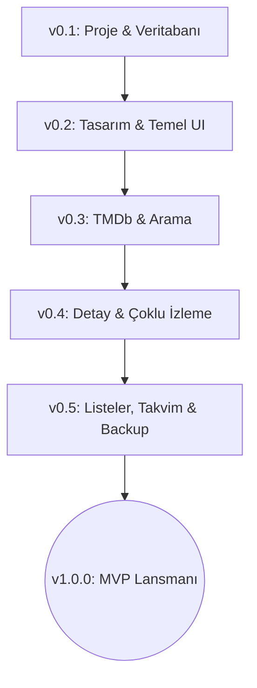

# FilmDizi Günlüğü - Yol Haritası ve MVP Tanımı (Roadmap & MVP)

Bu doküman, projenin adım adım geliştirilmesini sağlayacak modüler ve sürüm tabanlı (version-by-version) yol haritasını tanımlar. Büyük bir kodu tek seferde yazmak yerine, her aşamada çalışan ve test edilebilir bir uygulama elde etmeyi amaçlar.

---

## 📌 MVP (Minimum Viable Product) Kapsamı: Sürüm 1.0.0
MVP'nin amacı, bir film/dizi günlüğünün temel işlevini (Arama, Detay Çekme, Çoklu İzleme Kaydı Tutma ve Yerel Yedekleme) en yüksek tasarım kalitesiyle sunmaktır.

---

## 🛠️ Versiyon Detayları ve Geliştirme Adımları

### **Aşama 1: Temel MVP Geliştirme (v0.1 - v1.0.0)**

#### **✅ v0.1: Altyapı ve Veritabanı Mimarisi**
*   **Hedef**: Çalışan boş bir Flutter projesi ve ilişkisel veritabanı şeması.
*   **İşler**:
    *   Flutter projesinin oluşturulması.
    *   Klasör yapısının kurulması (Feature-First: `features/home`, `features/search`, `features/journal`, `features/settings` vb.).
    *   **Drift (SQLite)** veritabanının entegre edilmesi.
    *   *Veritabanı Tabloları*:
        *   `movies` (TMDb ID, Başlık, Poster, Yönetmen, Oyuncular, Türler, Süre, Konu, Yıl).
        *   `watch_records` (İzleme ID, Movie ID, Tarih, Saat, Mekan, Eşlik Edenler, Ruh Hali, Puan, Not, İzleme Numarası).
        *   `user_movie_settings` (Movie ID, Favori mi, Yeniden İzlenecek mi, Kişisel Not).
    *   Riverpod paketinin ve temel State notifiers'ın kurulması.

#### **✅ v0.2: Tasarım Sistemi ve Arayüz İskeleti (Shell UI)**
*   **Hedef**: Koyu tema odaklı, premium ve akıcı arayüzün temel taşlarının atılması.
*   **İşler**:
    *   `index.css` tarzı renk paleti, tipografi ve ortak bileşen stil tanımlamaları (`ThemeData` konfigürasyonu).
    *   Glassmorphism efektleri için genel widget'ların (`BackdropFilter` tabanlı) oluşturulması.
    *   Ana navigasyon yapısının kurulması (Bottom Navigation Bar).
    *   Ana Sayfa (Home) taslağının oluşturulması (Üst bilgi kartları, son izlenenler için yer tutucu yatay listeler).

#### **✅ v0.3: TMDb API Entegrasyonu ve Arama Motoru**
*   **Hedef**: Harici bir kaynaktan veri çekebilmek ve kullanıcının film aramasını sağlamak.
*   **İşler**:
    *   TMDb API entegrasyonu için istemci yazılması (Dio paketi ile).
    *   Arama ekranının tasarlanması (Filtreler: Tür, Yıl, Puan).
    *   Arama sonuçlarının premium kart tasarımlarıyla (Letterboxd stili poster grid) listelenmesi.

#### **✅ v0.4: Detay Sayfası ve Çoklu İzleme Kayıt Sistemi**
*   **Hedef**: Uygulamanın kalbini oluşturan, aynı filmi birden fazla kez izleme kaydıyla ekleyebilme özelliği.
*   **İşler**:
    *   Premium Film Detay Sayfası (IMDb ve Letterboxd melezi: Arka plan görseli, oyuncu listesi, yönetmen vb.).
    *   "İzleme Kaydı Ekle" modalı (Tarih seçici, Saat seçici, Mekan/İnsan girdisi, Ruh hali emojileri, 1-10 puan slider'ı, kişisel not alanı).
    *   Detay sayfasında geçmiş izleme kayıtlarının zaman tüneli (Timeline) olarak listelenmesi (Örn: "3. İzleme - 12.03.2026 - Sinemada").

#### **✅ v0.5: Listeler, Takvim ve Manuel Yedekleme (MVP Lansmanı)**
*   **Hedef**: MVP'yi tamamlayacak listeleme, takvim takibi ve veri güvenliğini sağlama.
*   **İşler**:
    *   Listeler Sekmesi (Görünüm Seçenekleri: Poster Grid & Detaylı Günlük Liste Görünümü arasında geçiş; İzlediklerim, İzleyeceklerim, Favoriler, Yeniden İzlenecekler filtreleri).
    *   Takvim Sekmesi (Aylık takvim üzerinde gün gün izlenen film ikonları).
    *   Ayarlar Sekmesi: JSON/CSV formatında tüm verileri dışa aktarma (export) ve geri yükleme (import).
    *   **v1.0.0 MVP Yayını.**

#### **✅ v0.6: Günlük Liste Görünümü Revizyonu ve Sıralama**
*   **Hedef**: Liste günlük görünümünü tablo yapısına kavuşturup sıralama, arama ve hızlı önizleme yetenekleriyle zenginleştirmek.
*   **İşler**:
    *   Film Adı, İzleme Tarihi, İzleme Sırası ve Puanım sütun başlıklarının (Table Header) eklenmesi.
    *   Sütunlara tıklayarak artan/azalan (▲ / ▼) dinamik sıralama yapısı.
    *   Günlük içi yerel arama çubuğu ve hızlı filtre çiplerinin entegrasyonu.
    *   Satıra uzun basarak (Long Press) kişisel notları ve izleme detaylarını gösteren hızlı önizleme penceresi.
    *   Kullanıcı tercihiyle "Kayıt Bazlı" tasarımın seçilmesi ve kod temizliği.

#### **✅ v0.6.1: Dinamik Mini İstatistik Barı (Mini Insights Bar)**
*   **Hedef**: Günlük içindeki filmlerin özet verilerini arama barının altında şık kartlarla göstermek.
*   **İşler**:
    *   Mevcut aydaki izleme adedi, ortalama puan, en popüler tür ve toplam sürenin hesaplanması.
    *   Yatay kaydırılabilir cam efektli istatistik kartlarının çizilmesi.

#### **✅ v0.6.2: "Yeniden İzleme (Re-Watch)" Görsel Rozeti**
*   **Hedef**: Birden fazla kez izlenen filmlere listede görsel vurgu katmak.
*   **İşler**:
    *   İzleme sırası > 1 olan kayıtlara satır üzerinde yeşil 🔄 rozetinin yerleştirilmesi.

#### **✅ v0.6.3: İzlenen Platform Simgeleri (Netflix, Prime, Sinema)**
*   **Hedef**: Mekan isminden otomatik platform tanıyıp simgeleştirmek.
*   **İşler**:
    *   Netflix, Prime, Sinema, Ev vb. kelime eşleştirmeleriyle renkli logo ve ikonların satırlara eklenmesi.

#### **✅ v0.6.4: Toplam Sinema Mesaisi Sayacı (Time Counter)**
*   **Hedef**: Günlük alt sınırında toplam izleme süresini toplu bir şeritte göstermek.
*   **İşler**:
    *   Listenin altına toplam süreyi saat ve dakika olarak özetleyen dinamik şerit eklenmesi.

#### **✅ v0.6.5: Sürükle-Bırak Kişisel Sıralama (Favorite Movie Ranking)**
*   **Hedef**: Listeyi sürükleyip bırakarak favori film sıralamasını (top list) anlık ve akıllı olarak yönetebilmek.
*   **İşler**:
    *   `ReorderableDragStartListener` ve `ReorderableListView` entegrasyonu.
    *   Sıra sütunu ekleme ve sıralı filmlerin yeşil `#1`, `#2` etiketleriyle parlatılması.
    *   Tutup yukarı çekildiğinde sıraya ekleyen, aşağı sırasız alana çekildiğinde sıralamadan çıkaran akıllı `onReorder` algoritması.
    *   Film Detay sayfası ve Hızlı Önizleme kutusuna el ile sıralama numarası girme/sıfırlama alanları.

#### **✅ v0.7.0: Özel Film Listeleri ve İlerleme Takibi (Custom Collections & Progress)**
*   **Hedef**: Kullanıcının kendi belirlediği isim/açıklama ile özel film listeleri oluşturabilmesi, yönetebilmesi ve sürükle-bırak yöntemiyle sıralayabilmesi.
*   **İşler**:
    *   `custom_lists` ve `custom_list_movies` Drift veritabanı tablolarının şemaya eklenmesi (şema sürümü v3).
    *   Alt navigasyon barına 6. sekme veya listeleme ekranının içine şık bir geçiş paneli entegrasyonu.
    *   Özel liste oluşturma, silme ve düzenleme arayüzleri.
    *   Film detay sayfasından veya listelerden pop-up (bottom sheet) ile filmi bir veya birden fazla özel listeye ekleme imkanı.
    *   Özel listelerin içinde neon renkli İlerleme Çubuğu (Progress Bar) ile izleme tamamlama oranlarının takibi.
    *   Özel liste içinde filmleri sürükleyip bırakarak el ile sıralama yeteneği.

#### **✅ v0.7.1: İnce Ayarlar - Anlık Kaydetme ve Çift İzleme Filtreleme**
*   **Hedef**: Mobil arayüzde sıralamayı anında kaydetmek ve mükerrer izleme kayıtlarının favori sıralamasını bozmasını önlemek.
*   **İşler**:
    *   Klavye tuşuna basmayı beklemeden anlık sıralama kaydı.
    *   Bir filmin sadece en son izleme kaydına sıralama etiketi verme.

#### **✅ v0.7.2: Güvenlik ve API Anahtarı Koruma Önlemleri**
*   **Hedef**: TMDb API anahtarının kod içerisinde açıkta durarak çalınmasını önlemek.
*   **İşler**:
    *   Hassas API anahtarının kodlardan arındırılması.
    *   Anahtar girişinin güvenli yerel depolamaya (Secure Storage) yönlendirilmesi.

#### **✅ v0.7.3: Dizi (TV Show) Arama ve Detay Desteği**
*   **Hedef**: Uygulamanın sadece filmlerle sınırlı kalmayıp dizileri de desteklemesi.
*   **İşler**:
    *   TMDb `/search/multi` endpoint entegrasyonu.
    *   Dizi verilerinin film veri modellerine normalizasyonu.

#### **✅ v0.7.4: Otomatik ve Güvenli API Anahtarı Yönetimi**
*   **Hedef**: Güvenliği bozmadan kullanıcının elle anahtar girme gereksinimini kaldırmak.
*   **İşler**:
    *   `api_key.dart` üzerinden yerel güvenli anahtar tanımlama.
    *   `.gitignore` dosyası ile bu yerel dosyanın sürüm kontrolüne girmesini engelleme.

#### **✅ v0.7.5: Eski Mock Poster Yollarının Güncellenmesi ve Çökme Çözümü**
*   **Hedef**: Kaldırılan TMDb poster yollarını yenilemek ve yüklenmeyen resimlerin düzeni çökertmesini önlemek.
*   **İşler**:
    *   Mock verideki poster yollarını güncel yollarla değiştirmek.
    *   `AppNetworkImage` ile resim yüklenirken boyut çökmesini engellemek.

#### **✅ v0.7.6: Film ve Dizi ID Çakışma Önleyici (Namespace Separation)**
*   **Hedef**: TMDb üzerindeki film ve dizi ID çakışmalarının yanlış sayfaları açmasını çözmek.
*   **İşler**:
    *   Drift veritabanına `isTv` alanını eklemek (Drift şema sürüm 4).
    *   Detay sayfasında dizi/film tipine göre doğrudan doğru endpoint'i sorgulatmak.

---

### **Aşama 2: Gelişmiş Özellikler ve İstatistikler (v0.8.0 - v0.9.0)**

#### **✅ v0.8.0: Detaylı Analiz & İstatistik Ekranı**
*   **Hedef**: Kullanıcının izleme alışkanlıklarını grafiklerle görselleştirmesi.
*   **İşler**:
    *   `fl_chart` paketi ile modern, etkileşimli aylık ve yıllık grafikler.
    *   En çok izlenen yönetmen, oyuncu ve türlerin listelenmesi.
    *   En aktif gün, en aktif ay verileri.
    *   Rozet Sistemi (İlk film, 10 film, 50 film rozetleri vb.).

#### **✅ v0.8.1: İzleme Yoğunluğu Haritası (Contribution Heatmap)**
*   **Hedef**: Son 365 günün günlük izleme sıklığını GitHub tarzı etkileşimli yoğunluk ızgarasıyla göstermek.
*   **İşler**:
    *   Yatay kaydırılabilir 53 sütunluk haftalık izleme ızgarası tasarımı.
    *   Tıklanan hücreye ait tarihi ve izlenen film/dizi sayısını gösteren akıllı cam efektli banner.
    *   Cinematic Red tonlarında yoğunluk legend'ı.

#### **✅ v0.8.2: İzleme Serisi (Streak) & Harita Filtreleme**
*   **Hedef**: Harita verilerini anlık filtrelemek ve izleme serilerini (streak) hesaplamak.
*   **İşler**:
    *   Mevcut ve en uzun izleme serilerinin (streak) Drift verilerinden hesaplanması.
    *   Heatmap üzerinde "Tümü", "Filmler" ve "Diziler" anlık filtre butonları.

#### **✅ v0.8.3: Puan Dağılım Grafiği & Eleştirmen Profili**
*   **Hedef**: 1-10 puan dağılım sıklığını göstermek ve izleyici tipini analiz etmek.
*   **İşler**:
    *   1-10 arası puanların dağılımını gösteren dikey sütun grafiği (`fl_chart` BarChart).
    *   Ortalamaya göre esprili Eleştirmen Profili değerlendirmesi.

#### **✅ v0.8.4: Zaman Kıyaslama & Mevsimsel Analiz**
*   **Hedef**: İzleme sürelerini eğlenceli şekilde görselleştirmek ve mevsimsel dağılımı ölçmek.
*   **İşler**:
    *   LotR maratonu ve uçuş süreleriyle eğlenceli zaman kıyaslama kartı.
    *   Mevsimsel izleme yüzdeleri (Kış, Yaz...) ve en aktif izleme günü (Altın Gün) gösterimi.

#### **✅ v0.9.0: Hatırlatıcılar, Maratonlar ve Etiket Yönetimi**
*   **Hedef**: Haftalık hedefler, geri sayımlı maratonlar ve özel hashtag etiketleriyle etkileşimi artırmak.
*   **İşler**:
    *   Watch records şemasına hashtag (`tags`) desteği eklenmesi ve günlüğe hashtag rendering ve filtreleme.
    *   Özel listelerin belirli hedef tarihi olan maratonlara dönüştürülebilmesi, kalan gün geri sayımı.
    *   Haftalık izleme hedefi belirleme, bu haftaki ilerleme halkası ve ayarlar dialoğu.

#### **✅ v0.9.1: Ağ Kararlılığı & Hotfix Güncellemesi (Network Resilience & Hotfixes)**
*   **Hedef**: Türkiye'deki internet servis sağlayıcılarının TMDb engellerini tamamen aşmak ve arama deneyimini akıcılaştırmak.
*   **İşler**:
    *   **Engelsiz Görsel Yükleme**: TMDb görsel sunucusunun (`image.tmdb.org`) engellerini aşmak için tüm görselleri yüksek hızlı `images.weserv.nl` Cloudflare proxy'sine yönlendirme.
    *   **Reklam Engelleyici Dostu Proxy**: Arama ve detay verilerini çekmek için reklam engelleyicilere ve sansüre takılmayan yüksek hızlı `corsproxy.io` entegrasyonu.
    *   **Zaman Aşımı & Doğrudan Yönlendirme**: İlk başarısız istekten sonra engeli hafızaya kaydedip sonraki tüm istekleri zaman aşımı bekletmeden doğrudan proxy'ye yönlendirme.
    *   **Arama Akıcılığı (Debouncing & Race Condition Guard)**: Yazarken her harfte istek atılmasını engelleyen 350ms geciktirme (debounce) ve eski isteklerin yeni sonuçları ezmesini engelleyen yarış durumu koruması.
    *   **Kullanıcı Dostu Ayarlar**: Teknik ayar ihtiyacını ortadan kaldırarak TMDb API ayar bölümünün ayarlardan kaldırılması, her şeyin arka planda tamamen otomatik yönetilmesi.

#### **✅ v0.9.2: DNS Engellerine Karşı Otomatik Bypass (DNS-over-HTTPS)**
*   **Hedef**: Bazı router/ISS'lerin DNS seviyesinde `api.themoviedb.org`/`api.tmdb.org`'u sessizce `127.0.0.1`'e yönlendirerek arama motorunu tamamen işlevsiz bırakmasını, kullanıcıdan hiçbir ayar istemeden otomatik olarak aşmak.
*   **İşler**:
    *   `DioClient`'a (native platformlarda) yeni bir bağlantı katmanı eklendi: normal DNS çözümlemesi bir loopback adresine (`127.0.0.1`) düşerse, istek otomatik olarak Cloudflare/Google DNS-over-HTTPS ile çözümlenen gerçek IP üzerinden (TLS SNI/Host değişmeden) yeniden deneniyor.
    *   Yeni `DohResolver` sınıfı (10 dakikalık önbellekli çözümleme, birden fazla DoH sağlayıcı fallback'i).
    *   API anahtarı hiçbir 3. parti servise gönderilmiyor (sadece hostname çözümleniyor, proxy kuralına aykırı değil).

#### **✅ v0.9.3: Ana Sayfa'nın Gerçek Veriyle Yeniden İnşası**
*   **Hedef**: Ana Sayfa'daki sabit/uydurma istatistikleri gerçek izleme verisine bağlamak ve ekranı sadece bir "son aktivite listesi" olmaktan çıkarıp aksiyon alınabilir hale getirmek.
*   **İşler**:
    *   İstatistik kartındaki "Toplam İzleme", "Ortalama Puan" ve "Haftalık Hedef" ilerlemesi artık `insightsProvider`/`weeklyGoalProvider`'dan geliyor (önceden sabit "42", "8.7" gibi uydurma değerlerdi).
    *   "Tümünü Gör" butonları artık gerçekten Günlük sekmesine geçiyor (yeni `mainShellTabIndexProvider` ile context'siz sekme değişimi).
    *   Mevcut izleme serisi (streak) rozeti eklendi.
    *   Yeni "Bu Hafta Ne İzlesem?" öneri kartı: kütüphanede olup hiç izlenmemiş filmlerden (favoriler öncelikli) gün bazlı deterministik bir öneri sunuyor, "Başka Öner" ile yenilenebiliyor (yeni `unwatchedMoviesProvider`).
    *   Tür dağılımı için mevcut Insights ekranındaki `GenreChartCard` widget'ı doğrudan yeniden kullanıldı (kod tekrarı yok).

#### **✅ v0.9.4: İzleme Yoğunluğu Haritası - Yıl Gezinme ve Tam Ekran Uyumu**
*   **Hedef**: Isı haritasının sadece kayan son 365 günü göstermesini ve telefon ekranlarına sığmamasını (yatay kaydırma gerektirmesini) çözmek.
*   **İşler**:
    *   Harita artık kayan pencere yerine seçili takvim yılına (1 Ocak - 31 Aralık) göre çalışıyor; başlığa `‹ Yıl ›` gezinme kontrolü eklendi, en eski veri yılından öteye ve gelecek yıllara gidilemiyor.
    *   Açılışta/yıl değiştirildiğinde otomatik olarak ilgili uca (içinde bulunulan yılda bugüne, geçmiş yıllarda Ocak'a) odaklanma.
    *   Yatay kaydırma tamamen kaldırıldı; hücre boyutu `LayoutBuilder` ile ekran genişliğine göre dinamik hesaplanıyor, tüm yıl her cihazda tek bakışta sığıyor.
    *   Üstteki toplam sayaç artık yanıltıcı tüm-zamanlı toplam yerine sadece o an görüntülenen yılın gerçek toplamını gösteriyor.

#### **✅ v0.9.5: İzleme Tarihi Doğrulaması**
*   **Hedef**: Bir filmin/dizinin çıkış tarihinden önceki bir tarihte "izlendi" olarak kaydedilebilmesini engellemek (ör. 2021'de çıkan bir yapımı 2006'da izledim denilememeli).
*   **İşler**:
    *   "İzleme Kaydı Ekle" tarih seçicisinin (`add_watch_record_sheet.dart`) `firstDate`'i artık sabit `2000` değil, `movieData['release_date']`'ten hesaplanıyor.
    *   Çıkış tarihi bilinmiyorsa veya gelecekteyse (henüz vizyona girmemiş yapım) geniş bir aralığa/bugüne düşülerek çökme engelleniyor.

#### **✅ v0.9.6: Bölüm Bazlı Süre Takibi (TV Dizileri)**
*   **Hedef**: TMDb'nin dizi başına döndürdüğü tek, sabit `episode_run_time` değerinin (ör. "Son Yaz" için 120 dk) her izleme kaydına aynen uygulanması yerine, gerçekte kaç bölüm izlendiğine göre ölçeklenebilmesini sağlamak.
*   **İşler**:
    *   `WatchRecords` tablosuna `episodeCount` (varsayılan 1) eklendi; "İzleme Kaydı Ekle" formuna (sadece diziler için) bir bölüm sayacı eklendi.
    *   Günlük/İçgörüler'deki "Toplam Süre" hesaplamaları artık `runtime × episodeCount` kullanıyor.
    *   **Bulunan ve düzeltilen gerçek hata**: Sayaç başta üst sınırsızdı (26 bölümlük bir dizide 26'nın ötesine çıkabiliyordu) **ve** "aktif izlemiyorsan" varsayılanı yanlışlıkla dizinin **tüm bölüm sayısına** eşitlenmişti — bu, aynı diziyi aktif modu kullanmadan birkaç kez loglayan bir kullanıcının Günlük'ünde "Toplam Süre"nin binlerce saate şişmesine yol açtı (gerçek kullanımda gözlemlendi: 1067 saat). Düzeltme: sayaç artık dizinin gerçek bölüm sayısıyla sınırlı **ve** varsayılanı her zaman **1 bölüm** (kullanıcı isterse elle yükseltebilir).

#### **✅ v0.9.7: "Aktif İzliyorum" — Dizi Bölüm Takip Sistemi**
*   **Hedef**: Bir diziyi bölüm bölüm takip ederken, her yeni bölümü loglarken "kaçıncı bölüm" bilgisini elle hesaplamak zorunda kalmadan, sistemin nerede kaldığını hatırlaması.
*   **İşler**:
    *   `Movies.totalEpisodes` (TMDb'den, önbelleklenmiş) ve `UserMovieSettings.isActivelyWatching` / `lastWatchedEpisode` alanları eklendi.
    *   "İzleme Kaydı Ekle" formuna diziye bağlı kalıcı bir "Aktif İzliyorum" anahtarı eklendi: açıkken sistem sıradaki bölümü otomatik önerip onaylatıyor; son bölüme ulaşınca anahtar otomatik kapanıp dizi "Tamamlandı" sayılıyor.
    *   Film Detay ekranına salt-okunur "İzleniyor (X/Y)" / "Tamamlandı" durum göstergesi eklendi.
    *   Günlük listesinde (tablo ve kart görünümü) tamamlanan diziler için yeşil ✓ rozeti eklendi.
    *   Yedekleme (export/import) yeni alanları destekliyor, eski yedeklerle geriye dönük uyumlu.

#### **✅ v0.9.8: Ana Sayfa ve Günlük'te Hızlı Bölüm Ekleme**
*   **Hedef**: Aktif izlenen bir dizinin sıradaki bölümünü loglamak için her seferinde tam "İzleme Kaydı Ekle" formunu (tarih/saat/ruh hali/mekan/not/etiket) açmak zorunda kalmamak.
*   **İşler**:
    *   Yeni `activelyWatchingProvider` ve paylaşılan `logNextEpisode` fonksiyonu (Ana Sayfa ve Günlük'ün aynı mantığı kullanması, birbirinden sapmaması için).
    *   **Ana Sayfa**: "Aktif İzlediklerin" yatay poster kartı listesi — poster üzerindeki "+" rozetine dokununca sadece puan soran minik bir diyalogla bölüm ekleniyor.
    *   **Günlük**: Kullanıcı geri bildirimiyle tasarım değişti — büyük kart listesi yerine, tablo/kart görünümünde diziye ait **en son kayda**, "Puanım" sütununun altında kompakt bir **"4/26 ➕"** etiketi eklendi. Dokununca **hiçbir ekran/diyalog açmadan**, son verilen puan otomatik kullanılarak bölüm anında kaydediliyor.
    *   **Bulunan ve düzeltilen görsel hata**: Bu etiket önce tablo görünümünde puanla aynı satıra (Row+Spacer) sıkıştırılmıştı; dar sütunda üst üste binip taşıyordu. Puan ve etiket artık alt alta (Column) diziliyor.

#### **✅ v0.9.9: Film/Dizi ID Çakışması — Kök Neden Düzeltmesi (Composite Key)**
*   **Hedef**: v0.7.6'da `isTv` alanı şemaya eklenmişti ama **primary key'in parçası yapılmamıştı** — bu yüzden aynı sayısal TMDb ID'sini paylaşan bir film ile bir dizi (TMDb'de film/dizi ID namespace'leri ayrı sayaçlardan geldiği için bu mümkün) hâlâ aynı veritabanı satırında çakışabiliyordu. Gerçek kullanıcı hatası: bir dizi ("Son Yaz") için günlüğe eklenen kayıt, daha sonra aynı ID'yi paylaşan bir filmin ("Whale Music") eklenmesiyle üzerine yazılıyor, kart hâlâ eski ismi gösterse de tıklanınca yanlış yapımı açıyordu.
*   **İşler**:
    *   **Şema (v8 migration)**: `Movies.primaryKey` → `{tmdbId, isTv}`; `UserMovieSettings.primaryKey` → `{tmdbId, isTv}`; `CustomListMovies.primaryKey` → `{listId, movieId, isTv}`; `WatchRecords`e yeni `isTv` sütunu. SQLite'ta PK/FK constraint'leri yerinde değiştirilemediği için migration, veri kaybı olmadan (tablo yeniden adlandır → yeni şemayla oluştur → veriyi kopyala → eskisini sil) 4 tabloyu da yeniden inşa ediyor.
    *   Tüm okuma/yazma katmanı (`database_provider.dart`, `movie_repository.dart`, `episode_logging.dart`, arama/favori/sıralama/özel liste akışları — toplam ~20 dosya) `tmdbId` yerine `(tmdbId, isTv)` composite anahtarına geçirildi (yeni `MovieKey` typedef'i).
    *   **Bağımsız gerçek bir hata da düzeltildi**: Takvim ekranından bir izleme kaydına tıklandığında `MovieDetailScreen`'e `isTv` parametresi hiç geçilmiyordu (her zaman varsayılan `false`), bu da takvimden açılan dizilerin her zaman film olarak sorgulanmasına yol açıyordu.
    *   Aynı kök nedenden kaynaklanan kozmetik/nadir edge-case'ler de düzeltildi: aynı ID'li film+dizi aynı ekranda göründüğünde Hero animasyon tag çakışması, `ReorderableListView`'de duplicate `ValueKey` riski, çevrimdışı arama sonuçları birleştirmesinde üzerine yazma, İçgörüler'deki "tekil yapım" sayımında çift sayım, yedekleme (backup) dışa aktarımında eksik `isTv` alanı.
    *   Mevcut testler (`movie_repository_test.dart`, `home_screen_render_test.dart`, `journal_screen_render_test.dart`, `movie_detail_screen_render_test.dart`, `insights_provider_test.dart`, `insights_screen_render_test.dart`, `contribution_heatmap_render_test.dart`, `actively_watching_quick_add_test.dart`, `journal_quick_advance_tag_test.dart`) yeni composite anahtar imzalarına göre güncellendi; `dart analyze lib` temiz, `flutter test` 20/20 geçiyor; web'de Ana Sayfa/Keşfet/Günlük ekranları elle doğrulandı.
    *   **Ayrı, bu kapsamın dışında bırakılan bulgu**: Yedekleme (export/import), `CustomLists`/`CustomListMovies` tablolarını (özel koleksiyonlar) hiç yedeklemiyor — takip görevi olarak işaretlendi, henüz uygulanmadı.

---

### **Aşama 4: Post-Launch İyileştirmeler (v1.0.x)**

#### **✅ v1.0.1: Dinamik Arka Plan Sistemi (Sinemasal Renk Efekti)**
*   **Hedef**: Her sayfada ekranda görünen film posterlerinin baskın renklerine göre arka planın canlı ve pürüzsüz şekilde değişmesi.
*   **İşler**:
    *   `DynamicBackgroundProvider` (Riverpod `StateNotifier`) ile merkezi renk yönetim sistemi kuruldu.
    *   `DynamicBackgroundWrapper` widgetı oluşturuldu: `BackdropFilter` yerine donanım hızlandırmalı 4 katmanlı `RadialGradient` animasyonu (web uyumlu, dikey çizgi artefaktsız).
    *   `AppNetworkImage` bileşenine `VisibilityDetector` entegrasyonu ile ekrana giren posterlerin renkleri asenkron olarak çıkarılıp kayıt edildi.
    *   Web'de `palette_generator` CORS kısıtlamasına karşı `?cors=1` proxy parametresi eklendi.
    *   Sekme değişimlerinde eski renklerin sızmasını önlemek için `deactivate()` yaşam döngüsü hook'u eklendi.

#### **✅ v1.0.2: Web Uyumluluğu ve Yerleşim Kararlılığı Düzeltmeleri**
*   **Hedef**: Web tarayıcısında görüntülenen iframe simülatöründe oluşan dikey çizgi bozulmalarını, sayfa kayma ve zıplama sorunlarını gidermek.
*   **İşler**:
    *   `DynamicBackgroundWrapper` içindeki iç içe `Scaffold` yapısı kaldırıldı; sadece `Stack` döndürülerek Flutter'ın tek kök Scaffold kuralına uyuldu — tüm sayfa kayma ve zıplama sorunları çözüldü.
    *   Keşfet sayfasının boş durumundaki `Column` yapısı `SizedBox(width: double.infinity)` ile sarmalanarak içeriğin tam ortada hizalanması sağlandı.
    *   `VisibilityDetector`'ın `updateInterval = Duration.zero` ayarı sadece widget test ortamında uygulanacak şekilde kısıtlandı; debug/release modda render döngüsüne müdahale etmesi engellendi.

#### **✅ v1.0.3: Dinamik Arka Plan Sisteminin Yeniden Tasarımı (Sayfa Tabanlı Mimari)**
*   **Hedef**: Kaydırma sırasındaki kasılma/zıplama sorununu köklü olarak çözmek; web'de CORS nedeniyle `palette_generator`'ın renk çıkaramadığı durumlarda arka planın çalışmaya devam etmesini sağlamak; renk kaynağını her sayfanın veri modeliyle doğrudan ilişkilendirmek.
*   **İşler**:
    *   **`VisibilityDetector` tamamen kaldırıldı.** `AppNetworkImage` artık arka plan sistemiyle hiçbir şekilde iletişim kurmuyor; hafif, bağımsız bir resim gösterme bileşenine dönüştürüldü. Bu değişiklik kaydırma sırasındaki kasılma ve zıplama sorununu kalıcı olarak çözdü.
    *   **Sayfa tabanlı renk koordinasyonu**: Tüm arka plan güncellemeleri artık `WidgetsBinding.instance.addPostFrameCallback()` aracılığıyla render döngüsünden bağımsız olarak tetikleniyor.
    *   **Ana Sayfa**: `allWatchRecordsProvider` izlenerek son izlenen **3 filmin** posterleri renk kaynağı olarak kullanılıyor.
    *   **Keşfet Sayfası**: Arama sonuçlarının **ilk filmi** renk kaynağı olarak kullanılıyor; sorgu boşsa veya sonuç yoksa arka plan temizleniyor.
    *   **Film Detay**: Sayfaya girildiğinde ilgili filmin poster rengi uygulanıyor; sayfa kapatıldığında (`dispose`) önceki sayfanın renkleri otomatik olarak geri yükleniyor.
    *   **Günlük / Takvim / Ayarlar**: Bu sekmelere geçildiğinde arka plan renkleri temizlenerek varsayılan koyu temaya dönülüyor (`clearColors()`).
    *   **HSL Fallback**: Web'de CORS nedeniyle `palette_generator` görsel renk çıkartamazsa, filmin başlığından deterministik bir HSL rengi üretiliyor — arka plan sistemi her koşulda çalışıyor.
    *   `DynamicBackgroundNotifier`'a `updateMoviesFromList`, `updateMoviesFromMapList` ve `clearColors` metodları eklendi.
    *   Renk çıkarma hatalarında HSL fallback rengi hem state'e hem cache'e yazılıyor; hatalı `ApiConstants.imageHost` referansı `ApiConstants.imagePathW500` ile düzeltildi.
    *   20 otomatik test başarıyla geçiyor; `MovieDetailScreen` `ConsumerStatefulWidget`'a dönüştürüldü ve `dispose()` içindeki `ref.read()` çağrıları `try/catch` ile korundu.

#### **✅ v1.0.4: Günlük Kayıtları Düzenleme ve Akıllı Bölüm Sayısı Doldurma**
*   **Hedef**: Günlük kayıtlarını esnetmek, yanlış girilen verileri (tarih, bölüm sayısı) doğrudan liste üzerinden düzenleyebilmek veya silebilmek. Ayrıca dizi izlerken tekrar eden manuel girişleri azaltmak.
*   **İşler**:
    *   Günlük sayfasında bir kayda basılı tutulunca açılan Önizleme (Preview) ekranına "Tarih ve Saat Düzenleme", "Bölüm Sayısı Düzenleme" (diziler için) ve "Kaydı Sil" özellikleri eklendi.
    *   `showDatePicker`, `showTimePicker` ve özel bölüm giriş dialoglarıyla, sayfa değiştirmeden ve anında listeye yansıyan veri güncellemesi.
    *   Kayıt ekleme (`add_watch_record_sheet.dart`) formunda, "Aktif İzliyorum" kapalıysa "Kaç bölüm izledin?" seçeneğinin varsayılan olarak dizinin **toplam bölüm sayısına** eşitlenmesi sağlandı (böylece tüm diziyi bitirenler için otomatik tamamlama).
    *   Drift `WatchRecords` tablosu işlemleri (deleteWatchRecord, updateWatchRecord) native/web platformları için ayrıştırılarak eklendi.

---

### **Aşama 5: Büyük Sürümler & Sosyal Entegrasyonlar (v1.1.0 - v1.3.x)**

#### **✅ v1.1.0 (Faz 3): Dizi Desteği & Çoklu Sezon İzleme Takip Sistemi**
*   **Hedef**: Dizilerin ve sezonların bölüm bazlı takibi için gerekli altyapıyı ve arayüz entegrasyonunu tamamlamak.
*   **İşler**:
    *   TMDb servisinin (`tmdb_service.dart`) dizi yaratıcılarını (creators) algılayacak şekilde güncellenmesi ve film/dizi yönetmen bilgisinin ayrıştırılması.
    *   Dizi izleme kayıtlarında veritabanı şemasının composite keys (`movieId`, `isTv`) ile çakışmaları tamamen engelleyecek hale getirilmesi.
    *   "Aktif İzliyorum" modunun varsayılan olarak en son kalınan bölümden başlatılması ve son bölüme ulaşınca otomatik tamamlanması.

#### **✅ v1.2.0 (Faz 4): Topluluk Akışı & Etkileşimli Yorum Sistemi**
*   **Hedef**: Kullanıcıların izleme günlüklerini paylaşabileceği dinamik bir sosyal akış ve yorum altyapısı kurmak.
*   **İşler**:
    *   Firestore üzerinde `logs` koleksiyonu ile tüm kullanıcıların paylaşımlarını bir araya getiren Topluluk Akışı (Community Feed) sayfası oluşturulması.
    *   Gönderilere beğeni (star) bırakma ve gerçek zamanlı yorum yapabilme altyapısının (`comments_sheet.dart`) entegre edilmesi.
    *   Kullanıcı avatarları ve kullanıcı isimleriyle sosyal profillere yönlendirme linklerinin kurulması.

#### **✅ v1.3.0 (Faz 5): Sosyalleşme & Takip Sistemi ve Akış Filtreleme**
*   **Hedef**: Kullanıcılar arası takip etme/bırakma mekanizmalarını kurmak ve sosyal akışı kişiselleştirmek.
*   **İşler**:
    *   Firestore'da `follows` koleksiyonu oluşturularak takipçi/takip edilen takibi ve kullanıcı belgelerinde sayaçların güncellenmesi.
    *   Sosyal Profil ekranının (`user_profile_screen.dart`) tasarlanması, diğer kullanıcıların profillerinde "Takip Et / Takibi Bırak" butonu ve o kişilerin günlük poster listelerinin görüntülenmesi.
    *   Topluluk Akışına "Tümü" ve "Takip Ettiklerim" filtre sekmelerinin eklenmesi.

#### **✅ v1.3.1: Hata Çözümleri & Arayüz Cilalaması**
*   **Hedef**: Büyük sürümlerin ardından gelen kullanıcı geri bildirimleriyle donma hatalarını gidermek ve arayüzü kusursuzlaştırmak.
*   **İşler**:
    *   **Giriş/Çıkış Yüklenme Hatası**: Riverpod stream dinleyicilerindeki caching/initial data sorunu çözülerek çıkış yapıp tekrar girildiğinde donması engellendi.
    *   **Dizi Yönetmen Düzeltmesi**: Firestore'daki `movieDirector` ile `DiaryLogModel`'deki `director` alan uyuşmazlığı giderildi, eski kayıtları da koruyacak geriye dönük uyumluluk filtreleri eklendi.
    *   **İstatistik Kartları Redesign**: Kutucuklar 2x2 grid yapısına geçirilerek büyütüldü ve yanlarına ikonlar eklenerek premium bir görünüme kavuşturuldu.
    *   **Sürelerin Güne Çevrilmesi**: Toplam izleme süreleri 24 saati geçtiğinde gün formatına (`7g23s30dk` gibi) çevrilecek şekilde güncellendi.
    *   **Filtre Çubuğunun Kaldırılması**: Ekran sadeleştirilerek Günlük sayfasındaki filtre çubukları kaldırıldı.
    *   **Sekme Çubuğu (TabBar) Ortalama & Yazı Büyütme**: Sekmeler tam ekran genişliğine yayılacak şekilde ortalandı, yazı boyutu 15px'e çıkarıldı ve "Analiz" olarak kısaltıldı. Tıklama esnasında oluşan kare renk taşması (splash) dairesel hale getirildi.
    *   **Zaman Kıyaslama Paneli Dinamik Karşılaştırmalar**: "Bu Sürede Neler Yapabilirdin?" kartı, her ekran açılışında 16 farklı eğlenceli ve ilginç seçenek arasından rastgele 1 tanesini seçecek ve özel emojisiyle gösterecek şekilde güncellendi.

#### **✅ v1.3.2: İzleme Girişi Sadeleştirmesi ve Kaydırma Çubuğu Optimizasyonu**
*   **Hedef**: Günlük kayıt formunu sadeleştirmek, mobil ekranlarda istatistik taşmasını engellemek ve kaydırma çubuklarını tamamen temizleyerek mobil kaydırma deneyimi sunmak.
*   **İşler**:
    *   **Saat Seçiminin Kaldırılması**: Film/dizi günlüğe eklenirken saat bilgisinin elle girilmesi zorunluluğu (ve seçici alanı) formdan tamamen kaldırıldı.
    *   **İstatistik Paneli Taşma Çözümü**: Mobil ekran genişliğinde (<500px) İstatistik Dashboard'undaki mini veri kartlarının taşmasını önlemek amacıyla `_buildMiniStat` bileşenleri `FittedBox` ile sarmalandı, yazılar dar ekranlarda otomatik olarak küçülecektir.
    *   **Scrollbar'ların Komple Kaldırılması**: Uygulama genelinde afişlerin üzerine binen veya çirkin görüntü oluşturan tüm kaydırma çubukları hem Flutter (`CineFileScrollBehavior`) hem de tarayıcı (Gölge DOM / Shadow DOM) seviyesinde tamamen görünmez kılındı.
    *   **Fareyle Kaydırma (Mouse Drag to Scroll) Desteği**: Masaüstü tarayıcılarda yatay listelerin dokunmatik ekranlardaki gibi fareyle sürüklenerek (mouse-drag) veya izleme paneliyle akıcı şekilde kaydırılabilmesi sağlandı.

#### **✅ v1.3.3: Topluluk Akışına Gizlilik/Paylaşım Kontrolü**
*   **Hedef**: v1.2.0'da kurulan Topluluk Akışı'nın, kullanıcı onayı olmadan HER izleme kaydını (özel notlar dahil) herkese açık göstermesini durdurmak; paylaşımı kullanıcının açıkça seçtiği (opt-in) bir davranışa çevirmek.
*   **İşler**:
    *   `WatchRecords` tablosuna (Drift, schema v9, veri kaybı olmayan migration) ve `DiaryLogModel`e (Firestore) `isPublic` alanı eklendi — varsayılan **gizli (false)**; `isPublic` alanı olmayan tüm eski kayıtlar da geriye dönük olarak gizli sayılıyor.
    *   Kayıt ekleme formuna (`add_watch_record_sheet.dart`) ve günlük kaydı önizleme/düzenleme dialoguna (`watch_record_preview_dialog.dart`) "Topluluğa Paylaş" switch'i eklendi; otomatik bölüm loglaması (`episode_logging.dart`) her zaman gizli olarak kaydediyor.
    *   `community_feed_provider.dart` sorgusu `isPublic == true` filtresiyle sınırlandırıldı (kullanıcının kendi profilindeki "Son İzlediklerim" bölümü hâlâ tüm kayıtlarını gösteriyor).
    *   Projeye ilk kez `firestore.rules` ve `firestore.indexes.json` eklendi ve production'a deploy edildi — artık sunucu tarafında da gizli kayıtlar, başkasının profil/paylaşım bilgisi ve kimlik taklidiyle yazma engelleniyor (emulator'da 18 senaryoluk otomatik testle doğrulandı).

#### **✅ v1.3.4: Dizi Günlük Kaydı, Tarih Seçici ve Günlük Tablosu Cilalaması**
*   **Hedef**: Bir diziyi günlüğe eklerken "bitirdim mi yoksa hâlâ mı izliyorum" niyetini doğru varsayılanla yakalamak, eski bir tarihi seçerken ay ay geri gitme zorunluluğunu kaldırmak, kayıt formundan kaydetmeden çıkılamaması sorununu gidermek ve Günlük tablo görünümündeki hizalama/boyut sorunlarını düzeltmek.
*   **İşler**:
    *   **"Tüm Sezonu Bitirdim" Varsayılanı**: `add_watch_record_sheet.dart`'ta "Aktif İzliyorum" kapalıyken artık **"Tüm sezonu bitirdim"** (varsayılan seçili) ile **"Belirli sayıda bölüm"** arasında açık bir seçim var. Önceden varsayılan sessizce "1 bölüm izlendi" olarak kaydediyordu; artık varsayılan davranış diziyi doğrudan tamamlanmış (`lastWatchedEpisode = totalEpisodes`, `isActivelyWatching = false`) işaretliyor. Bu kayıt için sayılan bölüm sayısı, önceden loglanmış bölümler varsa sadece **kalanları** sayıyor (v0.9.6'daki "her ekleme tüm seriyi tekrar izlemiş gibi sayar" bug'ının tekrarlanmaması için delta hesaplaması korundu).
    *   **Elle Bölüm Sayısı Girişi**: "Belirli sayıda bölüm" seçildiğinde artık stepper'ın yanında sayıyı doğrudan yazabilen bir metin kutusu var — 786 bölümlük bir diziyi "+" ile tek tek tıklamak yerine direkt yazılabiliyor; toplam bölüm sayısını aşan girişler otomatik sınıra çekiliyor.
    *   **Kayıt Formunu Kapatma Butonu**: "Günlüğe İzleme Kaydı Ekle" sheet'inde daha önce açık bir kapatma (✕) butonu yoktu; içerik uzun olduğunda (özellikle dizi bölüm takibi açıkken) sheet tüm ekranı kaplayıp dışarı tıklanacak alan bırakmıyor, kaydetmeden çıkmayı imkânsız kılıyordu. Başlığa `Navigator.pop` çağıran bir ✕ butonu eklendi.
    *   **Tarih Seçicide Yıl Atlama**: `PremiumDatePicker`'da eski bir yılı seçmek için ay okuyla tek tek geri gitmek gerekiyordu. Başlığa (`Ay Yıl`) dokununca açılan bir **yıl ızgarası** eklendi; seçili yıla otomatik kaydırılıyor, bir yıla dokununca takvim doğrudan o yıl/aya atlıyor.
    *   **Günlük Tablosu Hizalama Düzeltmesi**: Tablo görünümünde "Puanım" sütunu sola hizalıydı; aktif izlenen bir dizinin son kaydında altına eklenen "Bölüm X/Y +" etiketiyle birlikte satırın ortasında ayrık/çakışan bir kutu gibi görünüyordu (kart görünümü zaten sağa hizalıydı, tutarsızlık vardı). Sütun sağa hizalandı, yıldız/puan/etiket ikonları büyütüldü.
    *   Tüm değişiklikler için widget testleri eklendi (`add_watch_record_episode_tracking_test.dart`, yeni `premium_date_picker_test.dart`); `dart analyze lib` temiz, `flutter test` 24/24 geçiyor.

#### **✅ v1.4.0: Topluluk Keşfi, Kullanıcı Arama ve Gerçek "Post" Sistemi**
*   **Hedef**: Topluluk Akışı'nı, kullanıcıların birbirini bulabildiği ve yapılandırılmış içerik paylaşabildiği gerçek bir sosyal akışa dönüştürmek — kullanıcı adına göre arama/keşif eklemek, akışın en üstüne (serbest metinli bir gönderi kutusu OLMADAN) yapılandırılmış bir paylaşım kutusu koymak, ve "paylaşım" kavramını `logs.isPublic` bayrağının yeniden yorumlanmasından gerçek, bağımsız, kalıcı "post" nesnelerine taşımak.
*   **İşler**:
    *   **Kullanıcı Arama/Keşif**: Yeni `user_search_provider.dart`/`user_search_screen.dart` — kullanıcı adına göre case-insensitive prefix araması (`usernameLower` alanı, `AuthController.signUp()`'ta otomatik yazılıyor; mevcut kullanıcılar için bir kerelik backfill script'i çalıştırıldı). Topluluk Akışı'na arama ikonu, boş "Takip Ettiklerim" durumuna "Kullanıcı Ara" CTA'sı eklendi. Paylaşılan `FollowButton` widget'ı + `toggleFollow` helper'ı ile takip et/bırak mantığı tek yere toplandı.
    *   **Profil Gizlilik Düzeltmesi**: `watchRecordsForUserProvider`, başkasının profiline bakan bir ziyaretçiye o kişinin **özel** kayıtlarını da sorgulatıp `permission-denied` hatası veriyordu (Firestore rules bunu reddediyordu). Sorguya, sahibi olmayan görüntüleyiciler için `isPublic == true` filtresi eklendi.
    *   **Gerçek Post Modeli**: Topluluk Akışı artık `logs` koleksiyonunu `isPublic` ile filtrelemek yerine yeni bir `posts` koleksiyonunu okuyor (`community_post_model.dart`). Her paylaşım eylemi kendi bağımsız, kalıcı post'unu oluşturuyor — biri diğerinin içine gömülmüyor (önceki "kullanıcının tüm açık kayıtlarını tek kartta topla" tasarımı, yeni bir paylaşımın eski bir toplu paylaşımın içinde kaybolmasına yol açan gerçek bir bug'a neden olmuştu, bu yüzden tamamen kaldırıldı):
        *   **Film Paylaş**: `share_movie_picker_sheet.dart` ile tek bir günlük kaydı seçilir, `share_compose_sheet.dart` ile zorunlu bir mesaj yazılır ("çok güzel filmdi bitirdim" gibi), o anki film/puan/mod bilgisiyle donmuş bir `movie` tipi post oluşturulur.
        *   **Günlüğünü Paylaş**: Aynı seçim ekranının çoklu-seçim modu; seçilen kayıtlar donmuş bir `entries` dizisi olarak tek bir `diary_snapshot` post'una gömülür — post oluşturulduktan SONRA günlüğe eklenen yeni filmler o postu **asla** etkilemez (`user_public_diary_screen.dart` artık canlı bir sorgu değil, doğrudan post'un kendi donmuş listesini gösteriyor).
        *   **Koleksiyon Paylaş**: Film/günlük paylaşımlarının aksine bilinçli olarak **canlı senkronize** — `CustomLists` tablosuna (Drift, schema v10) `isPublic` sütunu eklendi; paylaşılan bir koleksiyon her düzenlemede (`movie_repository.dart`'taki `_mirrorSharedCollection`) yeni `shared_collections/{ownerId_listId}` Firestore belgesine otomatik yeniden yazılıyor, görüntüleyiciler `sharedCollectionProvider` ile bunu canlı izliyor (`shared_collection_detail_screen.dart`). Koleksiyon yönetim ekranına (`custom_list_detail_screen.dart`) "Toplulukla paylaşılıyor" rozeti + "Paylaşımı Durdur" aksiyonu eklendi. Web build'de bu özellik devre dışı (yalnızca native/Drift tarafı aynalanıyor).
        *   Topluluk Akışı'nın en üstüne bir "paylaşım kutusu" eklendi (`community_feed_screen.dart`) — X/Twitter tarzı görünüyor ama dokunulduğunda serbest metin yazmak yerine `share_options_sheet.dart`'ın üç yapılandırılmış seçeneğini açıyor.
        *   Kayıt formundaki eski "Topluluğa Paylaş" anahtarı "Profilimde Göster" olarak yeniden adlandırıldı ve artık sadece profildeki "Son İzlediklerim" görünürlüğünü kontrol ediyor — Topluluk Akışı'ndaki paylaşımlarla tamamen bağımsız, ayrı bir mekanizma.
    *   `firestore.rules`'a `posts`, `posts/{id}/comments` ve `shared_collections` blokları eklendi ve production'a deploy edildi.
    *   `GlassContainer`'a şeffaf bir `Material` sarmalayıcı eklendi — içindeki `ListTile`/`CheckboxListTile` dokunma efektlerinin görünmez olduğu (Flutter'ın kendi assertion'ı) önceden var olan bir hatayı da düzeltti (`AddToListSheet` dahil).
    *   Kapsamlı yeni test dosyaları eklendi (kullanıcı arama, profil gizliliği regresyonu, post oluşturma/render, donmuş günlük snapshot regresyonu, canlı koleksiyon senkron regresyonu); `dart analyze lib` temiz, `flutter test` 45/45 geçiyor.

---

## 📈 Proje Durumu

Uygulama planlanan tüm MVP aşamalarını ve büyük sosyal özellikleri (Faz 3, 4, 5) başarıyla tamamlamıştır. Arayüz geliştirmeleri ve kullanıcı deneyimi optimizasyonları aktif olarak devam etmektedir.

